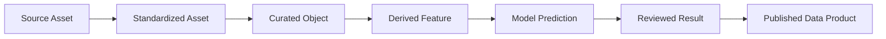

# End-to-End-Datenfluss

Jeder Übergang erzeugt eine neue, versionierte Repräsentation. Freigabe, Review und Fehlerbehandlung sind explizite Gates; Rückmeldungen verändern niemals stillschweigend das Original.
