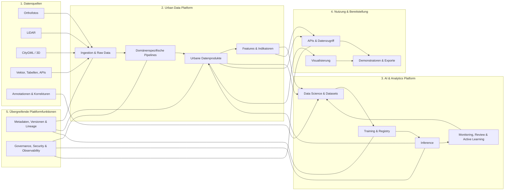

# Logische Gesamtarchitektur

**Status: Zielbild.** Das Diagramm zeigt Fähigkeiten, keine festgelegten Produkte.

Qualitätsprüfungen bleiben Teil der jeweiligen Domänenpipeline. Übergreifende Fähigkeiten vereinheitlichen nur Steuerung und Nachweis.
