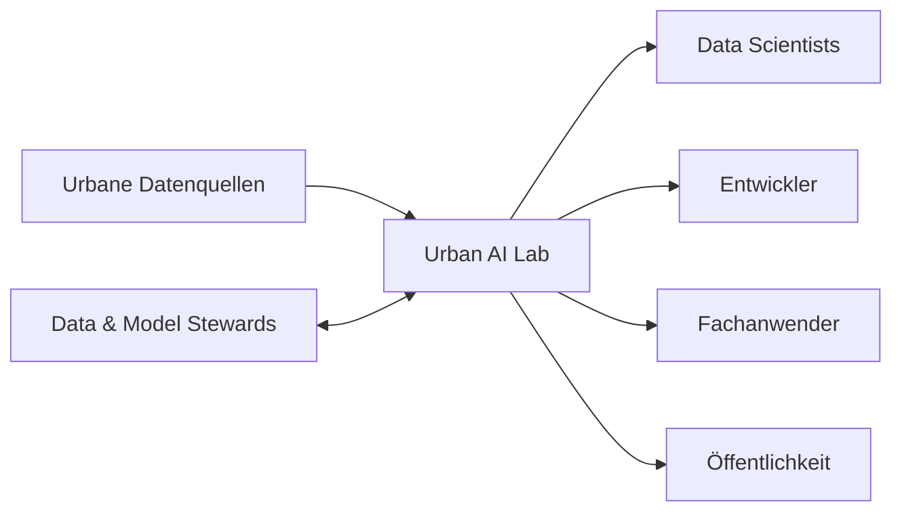

# Systemkontext

Das Urban AI Lab übernimmt Daten von öffentlichen, institutionellen und manuellen Quellen. Data Scientists, Entwickler, Fachanwender und die Öffentlichkeit nutzen ausschließlich freigegebene Datenprodukte über passende Zugriffspfade. Daten- und Modellverantwortliche prüfen Qualität, Versionen und Freigaben.

