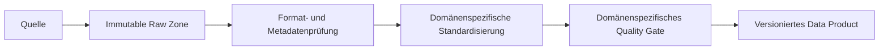

# Ingestion und Storage

Rohdaten werden nicht überschrieben. Speichertechnologien, Topologie und Orchestrator sind offene Architekturentscheidungen. Fehler erzeugen einen nachvollziehbaren Run-Status und keinen teilweise veröffentlichten Bestand.
