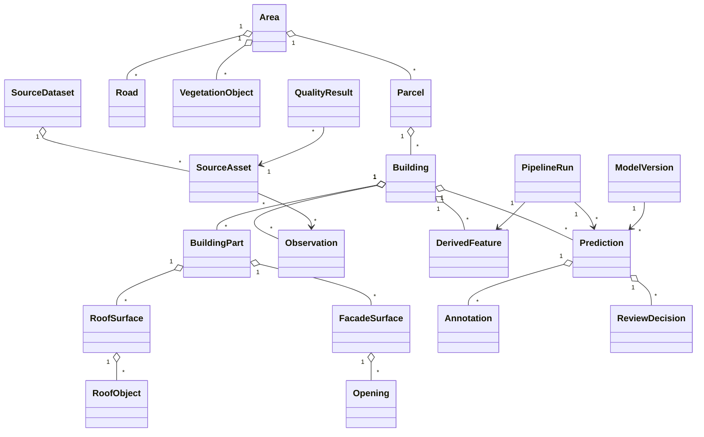

# Integriertes urbanes Objektmodell

**Status: Conceptual Draft** — kein physisches Datenbankschema.

Quellprodukte bleiben eigenständig. Interne stabile IDs verbinden urbane Objekte; Quell-IDs bleiben Referenzen. Beobachtungen, Features und Predictions sind getrennte, versionierte Entitäten mit Provenance.
