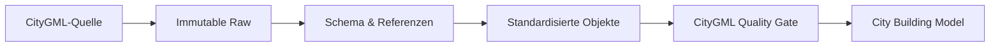

# CityGML-Pipeline

```mermaid
flowchart LR
 S[CityGML-Quelle] --> R[Immutable Raw] --> X[Schema & Referenzen] --> N[Standardisierte Objekte] --> Q[CityGML Quality Gate] --> P[City Building Model]
```
