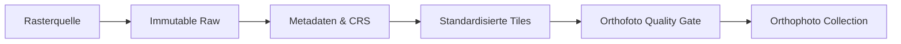

# Orthofoto-Pipeline

```mermaid
flowchart LR
 S[Rasterquelle] --> R[Immutable Raw] --> M[Metadaten & CRS] --> T[Standardisierte Tiles] --> Q[Orthofoto Quality Gate] --> P[Orthophoto Collection]
```

Chips werden deterministisch aus Produktversion, Geometrie und Processing-Version abgeleitet. Fehlerhafte Assets werden berichtet und nicht stillschweigend verworfen.
