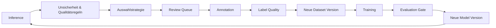

# Active Learning

```mermaid
flowchart LR
 I[Inference] --> U[Unsicherheit & Qualitätsregeln] --> S[Auswahlstrategie] --> R[Review Queue] --> A[Annotation] --> L[Label Quality] --> D[Neue Dataset Version] --> T[Training] --> E[Evaluation Gate] --> M[Neue Model Version] --> I
```

Automatisierung bleibt **Future**. Evaluation und Freigabe verhindern, dass neue Labels oder Modelle ungeprüft veröffentlicht werden.
