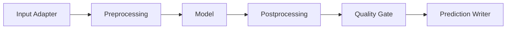

# Preprocessing und Postprocessing

```mermaid
flowchart LR
 I[Input Adapter] --> P[Preprocessing] --> M[Model] --> O[Postprocessing] --> Q[Quality Gate] --> W[Prediction Writer]
```

Alle Stufen werden eigenständig versioniert. Dadurch bleibt unterscheidbar, ob eine Änderung aus Eingabeaufbereitung, Modell oder Ergebnisverarbeitung stammt.
