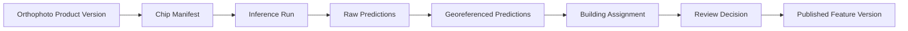

# Datenfluss

```mermaid
flowchart LR
 A[Orthophoto Product Version] --> B[Chip Manifest] --> C[Inference Run] --> D[Raw Predictions] --> E[Georeferenced Predictions] --> F[Building Assignment] --> G[Review Decision] --> H[Published Feature Version]
```

Jede Kante transportiert Referenzen auf Run, Code, Daten, Modell und Processing-Versionen.
