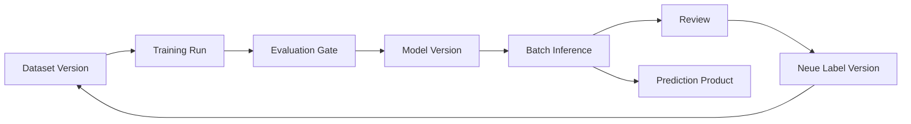

# ML Lifecycle

```mermaid
flowchart LR
 D[Dataset Version] --> T[Training Run] --> E[Evaluation Gate] --> M[Model Version] --> I[Batch Inference] --> R[Review] --> L[Neue Label Version] --> D
 I --> P[Prediction Product]
```

Evaluation, Human Review und Produktfreigabe sind getrennte Entscheidungen.
