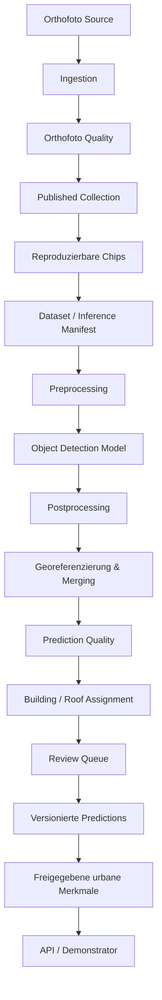

# Vertical Slice

Der Slice beginnt mit einem unveränderten Orthofoto-Asset und endet an einer veröffentlichten Schnittstelle. Orthofotoqualität ist nicht Prediction Quality; Modelloutput bleibt Prediction. Gebäudezuordnung ist ein eigener Integrationsschritt. Pre- und Postprocessing sind versioniert, Korrekturen überschreiben nie das Modellresultat.

