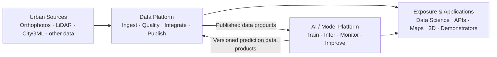

# L0 – Overall Architecture

## What is the long-term target system of the Urban AI Lab?

1. Urban source data is ingested and prepared through a shared Data Platform.
2. Each data domain retains its own processing and quality logic.
3. The AI / Model Platform is both a consumer and a producer of the Data Platform: it consumes published data products and writes reviewed, versioned predictions back as data products.
4. Applications may consume data products directly, AI results directly, or both. They do not have to pass through the AI platform.
