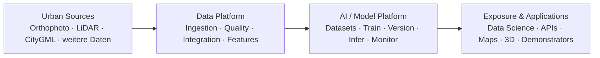

# L0 – Gesamtarchitektur

## Was ist das langfristige Gesamtsystem des Urban AI Lab?

1. Urbane Datenquellen werden über eine gemeinsame Data Platform aufgenommen und aufbereitet.
2. Jede Datenart besitzt eine eigene Processing- und Quality-Logik.
3. Die AI / Model Platform nutzt aufbereitete Daten für Training, Inference und kontinuierliche Verbesserung.
4. Ergebnisse werden über Data-Science-Zugriffe, APIs, Visualisierungen und Demonstratoren bereitgestellt.
