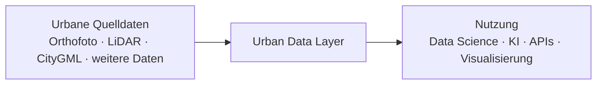

# L0 – Zielbild

## Was soll das Urban Data Layer leisten?

1. Unterschiedliche urbane Datenquellen werden in einer gemeinsamen Datenarchitektur verwaltet.
2. Jede Datenart behält ihre eigene Ingestion-, Transformations- und Qualitätssicherungslogik.
3. Nach der Aufbereitung können Daten gemeinsam analysiert, kombiniert und für Anwendungen bereitgestellt werden.

Die AI-/ML-Plattform wird aktuell bewusst nicht vertieft. Sie wird zunächst nur als nachgelagerter Nutzer des Datenlayers betrachtet.
