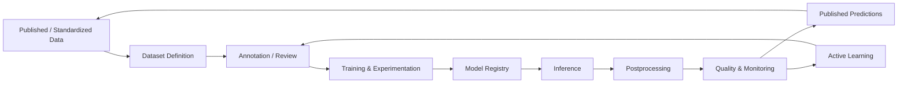

# L1 – AI / Model Platform

**Status: Conceptual**

> The AI Platform turns governed source data into reproducible models and turns model outputs into versioned, georeferenced, quality-controlled urban observations that are published back into the Data Platform.

The AI Platform is both a **consumer and a producer** of the Data Platform. It consumes governed source assets and canonical urban entities; after AI-specific quality checks, it publishes predictions back as governed upstream data.

AI development and production inference are related but distinct concerns. Development optimizes dataset curation, exploration, training, comparison, and approval. Production executes approved and explicitly versioned components in scheduled or triggered jobs.

The lifecycle follows these principles:

- training datasets are defined by reproducible, immutable versions rather than manually copied folders;
- model versions are tracked independently from preprocessing and postprocessing versions;
- raw model output remains traceable and is not silently overwritten by geospatial processing or human review;
- predictions become useful platform outputs only after georeferencing, urban-object assignment, and an AI quality gate;
- Active Learning feeds uncertainty, quality findings, and reviewed corrections into new label and dataset versions;
- cross-domain transformations and published analytical products begin after the prediction table has been published to the Data Platform.

The deeper design is split into only two L2 concerns:

1. [Model Lifecycle](l2-ai-model-lifecycle.md) — datasets, annotation, experiments, registry, promotion, monitoring, and Active Learning.
2. [Geospatial Inference & Postprocessing](l2-geospatial-inference-postprocessing.md) — COG access, coordinate transformations, geometries, assignments, quality, publication, and the dbt boundary.

Specific products and deployment platforms remain replaceable implementation choices.
