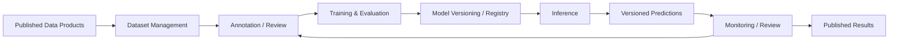

# L1 – AI / Model Platform

**Status: Conceptual**

Die Zielplattform umfasst:

- Dataset Management und Annotation / Label Review
- versioniertes Preprocessing, Training und Evaluation
- Model Versioning sowie versioniertes Postprocessing
- zunächst Batch Inference, später optional Online Inference
- Monitoring, Human Review und Active Learning
- Prediction Write-back als versionierte Ergebnisse

Diese Seite beschreibt nur das Zielbild. Konkrete Tools und Deployments sind noch nicht festgelegt.
