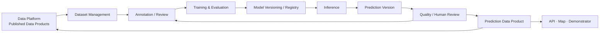

# L1 – AI / Model Platform

**Status: Conceptual**

The target platform includes:

- dataset management and annotation or label review;
- versioned preprocessing, training, evaluation, and postprocessing;
- model versioning and initially batch-first inference, with optional online inference later;
- monitoring, human review, and active learning;
- reviewed prediction write-back to the Data Platform as versioned data products.

A prediction data product can be published to an application or selected for a new dataset version and another training cycle. This page describes a target state; specific tools and deployments have not yet been selected.
