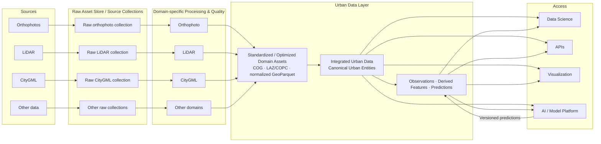

# L1 – Data Platform

## How do heterogeneous sources become usable data products?

## Raw asset store and source collections

Original assets remain traceable and are never overwritten. They may share physical object storage, but remain separate logical collections for orthophotos, LiDAR, CityGML, and other domains.

## Domain-specific processing

Each data type has dedicated processing and quality logic. Orthophotos, LiDAR, and CityGML are not forced through one generic quality process.

## Standardized and optimized domain assets

Standardization produces domain products suited to further processing; it does not force all domains into one homogeneous schema. Examples include COG orthophoto collections, LAZ or COPC LiDAR collections, and normalized GeoParquet city models.

## Integrated urban data

Spatial and semantic linking connects assets and records to canonical urban entities such as buildings, roofs, road segments, parcels, vegetation objects, and grid cells. Buildings are the first likely implementation focus, not the platform boundary. Source identifiers and provenance remain intact.

## Observations, features, and predictions

Reproducibly derived values retain their source, method, status, and pipeline version. Predictions written back by the AI / Model Platform remain distinguishable from observations, imported values, calculated features, imputations, and manual corrections.

## Access

The platform publishes data for Data Science, APIs, visualization, and the AI / Model Platform. Applications can consume Data Platform products without requiring an AI workflow.
