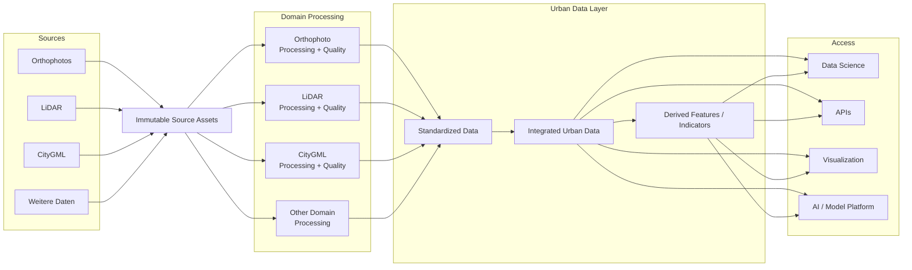

# L1 – Data Platform

## Wie werden heterogene Quellen zu nutzbaren Datenprodukten?

## Raw / Source Layer

Originaldaten bleiben nachvollziehbar erhalten und werden nicht überschrieben. Transformationen erzeugen neue Repräsentationen.

## Domain Processing

Jede Datenart besitzt eigene Processing- und Quality-Logik. Orthophoto, LiDAR und CityGML werden nicht durch denselben generischen Qualitätsprozess gedrückt.

## Standardized Data

Daten werden für weitere Verarbeitung aufbereitet. Standardisierung bedeutet nicht, dass alle Domänen dasselbe Format erhalten.

## Integrated Urban Data

Gemeinsame urbane Objekte verbinden die Quellen. Gebäude sind zunächst ein wichtiger Integrationsanker; Source IDs und Provenance bleiben erhalten.

## Derived Features

Merkmale werden reproduzierbar abgeleitet. Herkunft, Methode und Version bleiben nachvollziehbar.

## Access

Die Plattform stellt Daten für Data Science, APIs, Visualisierung und die AI / Model Platform bereit.
