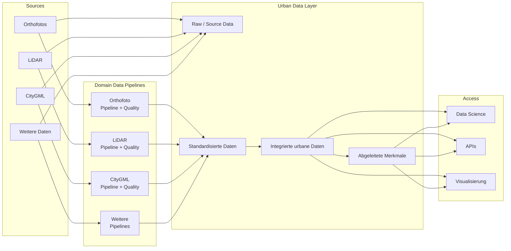

# L1 – Datenarchitektur

## Wie fließen Daten von der Quelle bis zur Nutzung?



## Sources

Orthofotos, LiDAR, CityGML und weitere urbane Daten unterscheiden sich stark in Format, Semantik, räumlicher Struktur, Aktualität und Qualitätsanforderungen.

## Raw / Source Data

Originaldaten bleiben nachvollziehbar erhalten und werden nicht stillschweigend überschrieben. Transformationen erzeugen neue Repräsentationen.

## Domain Data Pipelines

Jede Datenart besitzt ihre eigene Ingestion-, Transformations- und Qualitätssicherungslogik:

- **Orthofoto:** Raster- und Bildqualität
- **LiDAR:** Punktdichte, Ausreißer, Klassifikation und Abdeckung
- **CityGML:** Geometrie, Topologie, Semantik und Vollständigkeit

Qualitätsprüfung ist datentypspezifisch. Gemeinsame Standards betreffen nur Metadaten, Status, Versionierung, Lineage und Veröffentlichung.

## Integrated Urban Data

Standardisierte Daten werden über räumliche Objekte verknüpft. Gebäude sind derzeit ein wichtiger gemeinsamer Anker; weitere Objekttypen können später hinzukommen.

```text
Building
├── CityGML-Geometrie
├── zugehörige Orthofoto-Ausschnitte
├── LiDAR-Beobachtungen
├── abgeleitete Merkmale
└── spätere Modellvorhersagen
```

## Access

Das Datenlayer stellt aufbereitete und nachvollziehbare Daten für Data Science, APIs und Visualisierung bereit. Die vollständige AI-/ML-Plattform ist nicht Bestandteil dieser Dokumentationsstufe.
