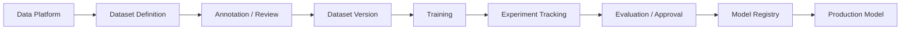
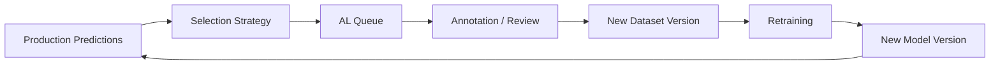

# L2 – Model Lifecycle

**Status: Conceptual**

The model lifecycle turns governed source data into approved, reproducible model versions. Experimentation and production inference share lineage, but run as separate operating concerns.



## Reproducible datasets

Training does not begin with manually copied image folders. A reproducible ML dataset consists of:

```text
Source Assets + Dataset Manifest + Window Definitions + Label Version
+ Preprocessing Configuration = Reproducible ML Dataset
```

A dataset definition records at least `dataset_id`, `dataset_version`, `source_snapshot`, `asset_ids`, window definitions or bounding boxes, split definition, `label_version`, `preprocessing_version`, `created_at`, and `code_commit`.

For COG rasters, chips are normally generated dynamically from source windows, so reproducibility does not require permanent duplication. Materialized chips remain useful for annotation tools, benchmark datasets, external exports, debugging, or performance caches.

## Annotation and review

Annotation is a dedicated platform capability:

```text
COGs / source assets
  → dataset / annotation manifest
  → selected windows
  → materialized annotation images, if required
  → annotation and review
  → bounding boxes / masks / polygons
  → validation
  → versioned label dataset
```

CVAT, Roboflow, and other annotation platforms are candidates; no product is mandatory. Outputs must be exportable into a canonical, vendor-independent format, versioned, and linked to their original source asset and spatial window. Review and production corrections can create governed labels for future training rather than disappearing into a dashboard.

## Training and experiment tracking

```text
Dataset Version + Training Code + Configuration
  → Training Run → Metrics / Artifacts → Experiment Tracking → Candidate Model
```

Each training run captures `training_run_id`, dataset and label versions, source snapshot, architecture, initial weights or foundation model, hyperparameters, preprocessing version, code commit, random seed, runtime environment, metrics, and artifacts.

MLflow is a strong candidate for parameters, metrics, artifacts, run lineage, and a model registry. It can run independently; using MLflow does not require Databricks. Databricks is one possible managed environment combining GPU compute, MLflow, Jobs/Workflows, Models and tables in Unity Catalog, and downstream SQL/dbt.

## Evaluation, registry, and promotion

Models never move directly from an experiment notebook into production:

```text
Experiment Run → Candidate Model → Evaluation → Approved Model Version → Production Inference
```

A registered version references `model_name`, `model_version`, `training_run_id`, dataset and label versions, preprocessing version, code commit, metrics, artifact location, approval status, and creation time. Registry entry is distinct from production approval.

The model artifact alone cannot reproduce a prediction. Reproduction requires:

```text
model version + preprocessing version + postprocessing version
+ source data version + inference configuration
```

## Development and production separation

Experimentation is optimized for exploration, iteration, model comparison, training, and dataset curation. Production uses an approved model plus production source data in a scheduled or triggered inference job, followed by versioned postprocessing, a quality gate, and publication. Batch inference is the initial primary mode; online inference would require a separate decision.

## Prediction lineage

A published prediction is traceable through two linked paths:

```text
Prediction → Inference Run → Model Version → Training Run
           → Dataset Version → Label Version → Source Snapshot

Prediction → Preprocessing Version
Prediction → Postprocessing Version
```

These references may be normalized across several physical tables; full traceability is the requirement.

## Active Learning



Selection strategies can use low confidence, high uncertainty, weak or ambiguous urban-object assignments, unusual size, new spatial regions, distribution shift, diversity, and human correction. The architecture supports multiple reproducible strategies rather than prescribing one. Evaluation and approval remain gates before a retrained model reaches production.

## Monitoring

Monitoring has four dimensions:

| Dimension | Examples |
|---|---|
| System / pipeline | runtime, failed tasks, GPU utilization and throughput, COG throughput, processed windows, cost, retries |
| Input | source snapshot, resolution, NoData, band statistics, brightness/contrast, spatial coverage, provider or metadata changes |
| Prediction | confidence and class distributions, predictions per km², object sizes, spatial distribution, count |
| Geospatial postprocessing | missing building/roof assignments, mean overlap, ambiguity, invalid polygons, out-of-area predictions, failures |

When reviewed ground truth is available, precision, recall, mAP/IoU, correction rate, and false-positive/false-negative rates are added. Thresholds are use-case-specific and may either warn or block publication.

## Portable platform mapping

The capabilities can be implemented with Databricks (GPU compute, MLflow, Models in Unity Catalog, Jobs/Workflows, Unity Catalog, SQL/dbt) or a self-hosted/open combination such as S3-compatible storage, Python/PyTorch GPU workers, Spark/Sedona where scale warrants it, MLflow, CVAT, dbt, PostGIS where required, and a workflow orchestrator. This architecture does not mandate either deployment model.

See [Geospatial Inference & Postprocessing](l2-geospatial-inference-postprocessing.md) for the production path from approved model to published prediction data.
