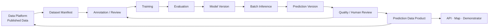

# L2 – AI Model Lifecycle

**Status: Conceptual**

- A dataset version is not necessarily a folder of duplicated files. Manifests can reference existing source assets.
- Preprocessing and postprocessing are versioned.
- Model output is a prediction, not ground truth; predictions have independent versions.
- Human review never silently overwrites the original prediction.
- Batch inference is initially the primary mode.
- Active learning is the complete feedback loop of prediction, review, selection, and renewed annotation—not one algorithm.
- Reviewed predictions return to the Data Platform as governed data products before publication or reuse in another dataset version.
