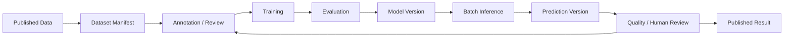

# L2 – AI Model Lifecycle

**Status: Conceptual**

- Eine Dataset-Version ist nicht gleichbedeutend mit einem Ordner duplizierter Dateien. Manifests können bestehende Source Assets referenzieren.
- Preprocessing und Postprocessing werden versioniert.
- Modelloutput ist eine Prediction, keine Ground Truth; Predictions besitzen eigene Versionen.
- Human Review überschreibt ursprüngliche Predictions nicht stillschweigend.
- Batch Inference ist zunächst der primäre Modus.
- Active Learning bezeichnet den gesamten Feedback-Loop aus Prediction, Review, Auswahl und erneuter Annotation – keinen einzelnen Algorithmus.
