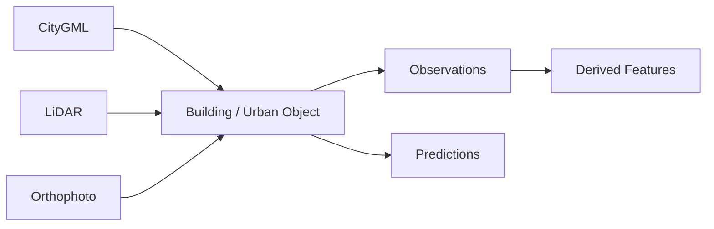

# L2 – Data Integration & Transformation

**Status: Conceptual; tooling candidates are Proposed**



## Integrationsprinzipien

- Interne Objekt-IDs sind stabil; Source IDs bleiben erhalten.
- Quellen werden nicht ohne Provenance verschmolzen.
- Observations, Features und Predictions bleiben unterscheidbar.
- Mehrere Versionen dürfen nebeneinander existieren.
- Cross-Source-Konflikte bleiben sichtbar.

## Structured Transformations as Code

Transformationen strukturierter Daten werden als Code versioniert und reproduzierbar ausgeführt.

```text
standardized_buildings
+ lidar_building_heights
+ roof_object_predictions
→ integrated_buildings
→ derived_building_features
→ published_building_dataset
```

## Rolle von dbt

**Candidate:** dbt eignet sich für SQL-basierte Tabellen und Views, Abhängigkeitsgraphen, Tests, dokumentierte Datenmodelle und materialisierte Transformationen.

dbt ist nicht die primäre Engine für GeoTIFF-zu-COG, Raster-Tiling, dynamische Chips, LAS/LAZ-Verarbeitung, CityGML-Parsing, Point Clouds oder Computer-Vision-Preprocessing. Für diese Schritte kommen Python beziehungsweise Spark / Sedona infrage; dbt kann anschließend strukturierte, kuratierte Tabellen transformieren.

Eine verbindliche Auswahl von dbt benötigt einen späteren ADR.
