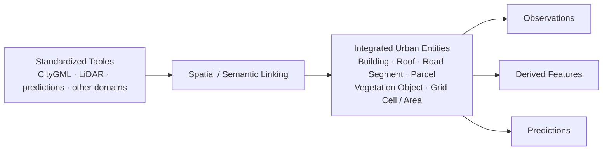
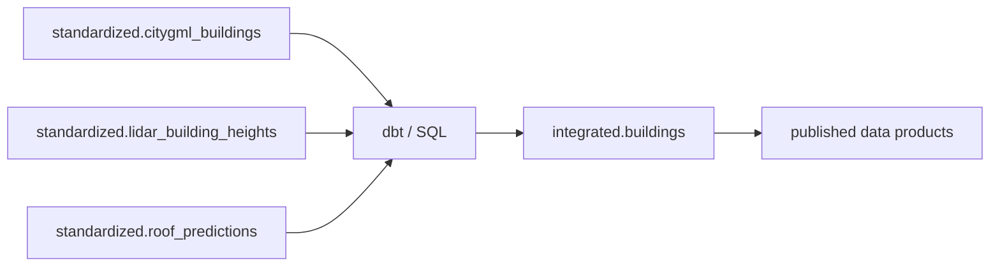

# L2 – Data Integration & Transformation

**Status: Conceptual; tooling candidates are Proposed**

Structured integration begins only after domain processing and domain quality have produced publishable standardized assets.

```text
GeoParquet / standardized files
        ↓
Domain Quality Gate
        ↓
REGISTER / PUBLISH
        ↓
Standardized Tables
        ↓
dbt / SQL transformations
        ↓
Integrated Tables
        ↓
Published Data Products
```

## Register / Publish

**Register / Publish** exposes a standardized structured asset through a logical table interface after its domain quality gate has passed. In a Candidate Databricks implementation:

```text
Object Storage
standardized/citygml/buildings/*.parquet
        ↓
registered in Unity Catalog as
        ↓
urban_ai_lab.standardized.citygml_buildings
```

The GeoParquet files remain the physical representation; the table provides a logical, queryable name:

```sql
SELECT COUNT(*)
FROM urban_ai_lab.standardized.citygml_buildings;
```

Registration can be a small final SQL or Python task in the domain workflow. It is not conceptually a dbt transformation and occurs only after domain quality passes.

```text
process_citygml
├── parse
├── normalize
├── geometry processing
├── write GeoParquet
├── quality check
└── register / publish tables
```

## Catalog, schema, table, and view

For a Candidate Databricks/Unity Catalog implementation, the namespace is:

```text
Catalog
└── Schema
    ├── Table
    └── View
```

```text
urban_ai_lab                    ← catalog
├── standardized               ← schema
│   ├── citygml_buildings
│   ├── citygml_roof_surfaces
│   └── lidar_building_heights
├── integrated
│   └── buildings
└── published
    └── pv_potential
```

Here, `schema` means a namespace/container for tables and views. It is distinct from a table's column schema.

## Integration model and principles



An orthophoto remains a raster asset and LiDAR remains a point-cloud asset. Integration links them spatially or semantically to entities rather than treating every source as a building record.

- Internal entity IDs are stable; source IDs and provenance are retained.
- Sources are not merged without lineage, and multiple versions may coexist.
- Observed, imported, calculated, imputed, predicted, and manually corrected values remain distinguishable.
- Cross-source conflicts remain visible.
- Buildings are the first likely entity type while the model remains extensible.

GeoParquet remains an analytical CityGML projection. Relations among buildings, building parts, roof surfaces, and wall surfaces retain stable internal IDs, `source_citygml_id`, `source_version`, hierarchy, semantics, and provenance.

## dbt starts after domain publication



dbt consumes already registered/published Standardized Tables as sources. It is not responsible for parsing CityGML, generating COGs, processing point clouds, or initially registering file assets.

**Candidate benefits:** transformations as code; SQL joins; derived columns; filtering; aggregation; a reusable dependency graph; documentation; data tests; view, table, and incremental materializations; and Git-versioned transformation logic. dbt manages SQL models executed by a target compute engine; it is not itself an alternative to that engine.

dbt YAML can declare sources, document models and columns, express ownership/metadata conventions, and define `not_null`, `unique`, relationship, accepted-value, and custom data-product tests. Conceptual assertions include:

```text
building_id must not be null
building_id must be unique
pv_area_m2 <= roof_area_m2
building height must be plausible
```

Not every geospatial quality rule belongs in dbt:

```text
DOMAIN QUALITY — before registration
→ Python / geospatial processing
→ CityGML geometry, CRS, image quality, point-cloud quality

DATA PRODUCT QUALITY — after registration / transformation
→ dbt tests
→ uniqueness, nullability, relationships, business rules
```

## Execution and versioning

dbt does not automatically execute merely because a source table changes. The orchestrator/workflow triggers it after successful upstream processing.

```text
New CityGML Source Snapshot
        ↓
CityGML processing workflow
        ↓
Domain Quality passes
        ↓
Standardized Table published
        ↓
dbt build
        ↓
affected Integrated Models / Published Data Products rebuilt
```

```text
Git / dbt      → versions transformation logic
Data Platform  → versions source and data states
```

dbt does not automatically version all historical data values.

## CityGML end-to-end candidate

**Status: Conceptual / Proposed**

```text
Provider
  ↓
CityGML .gml
  ↓
S3-compatible Object Storage / RAW
  ↓
Python / PySpark pipeline
  ├── validate
  ├── parse
  ├── normalize semantics
  └── convert geometries
  ↓
Sedona spatial processing (where useful)
  ↓
GeoParquet
  ↓
Domain Quality Gate
  ↓
Register / Publish
  ↓
standardized.citygml_buildings
standardized.citygml_roof_surfaces
  ↓
dbt / SQL
  ↓
integrated.buildings
  ↓
Published Data Products
  ↓
Data Science / AI / API / Visualization
```
