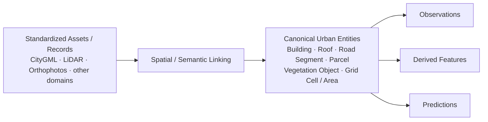

# L2 – Data Integration & Transformation

**Status: Conceptual; tooling candidates are Proposed**



An orthophoto remains a raster asset and LiDAR remains a point-cloud asset. Integration links them spatially or semantically to an entity; it does not pretend that every source is itself a building record.

## Integration principles

- Internal entity IDs are stable and original source IDs are retained.
- Sources are not merged without provenance.
- Observations, imported values, calculated features, imputations, predictions, and manual corrections remain distinguishable.
- Multiple versions may coexist and cross-source conflicts remain visible.
- Building is the first likely entity type, while the model remains extensible to other urban entities.

## Value provenance and missing values

Every material value should record where it came from and how it was produced. Recommended statuses are `observed`, `imported`, `calculated`, `imputed`, `predicted`, and `manually_corrected`.

```yaml
attribute: building_height
value: 13.2
unit: m
status: calculated
method: lidar_percentile
source: lidar_2025
pipeline_version: v1.4
```

An imputed construction year must record its method and must never be indistinguishable from an authoritative source value.

## CityGML semantics and provenance

GeoParquet does not replace CityGML. It is an analytically optimized projection that must preserve semantics, hierarchy, and provenance. Relations between buildings, building parts, roof surfaces, and wall surfaces therefore retain stable internal IDs, `source_citygml_id`, and `source_version`.

## Structured transformations as code

Structured-data transformations are versioned and executed reproducibly:

```text
standardized_buildings
+ lidar_building_heights
+ roof_object_predictions
→ integrated_buildings
→ derived_building_features
→ published_building_dataset
```

## Role of dbt

**Candidate:** dbt can model, version, test, document, and materialize SQL transformations. It manages SQL models executed by a target compute engine; it is not itself an alternative to that engine.

```text
Compute engines: Postgres / PostGIS or Spark / Sedona
                         ↑
           SQL models managed and tested with dbt
```

dbt is not the primary mechanism for GeoTIFF-to-COG conversion, raster tiling, dynamic chips, LAS/LAZ processing, CityGML parsing, point clouds, or computer-vision preprocessing. Python or Spark / Sedona may perform those operations, after which dbt may transform structured, curated tables. Selecting dbt requires a later ADR.
