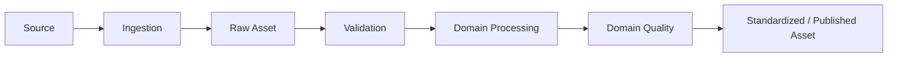

# L2 – Domain Data Processing

**Status: Conceptual**

Die Pipeline-Struktur kann ähnlich sein; die inhaltliche Quality-Logik ist je Datendomäne unterschiedlich. Konkrete Schwellenwerte sind noch offen.

| Domäne | Qualitätsdimensionen |
|---|---|
| Orthophoto | technische Lesbarkeit, CRS, Auflösung, Abdeckung, NoData, Bildqualität, zeitliche Eignung |
| LiDAR | technische Lesbarkeit, Punktdichte, Ausreißer, Klassifikation, Höhenreferenz, räumliche Abdeckung |
| CityGML | Schema, IDs, geometrische Validität, Topologie, Semantik, Vollständigkeit, Höhenbezug |
