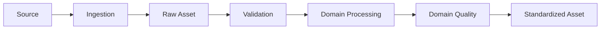
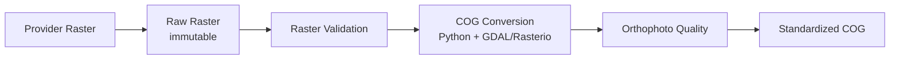
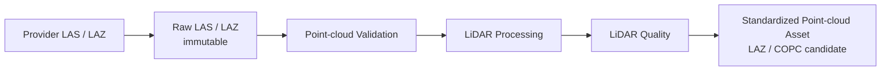
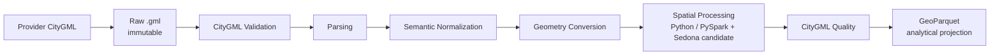

# L2 – Domain Data Processing

**Status: Conceptual; technology choices are Proposed or Candidate**

Domain pipelines follow a common sequence while using processing and quality rules appropriate to each data type.



The **Standardized Asset** is a new representation. The **Raw Asset**, meaning the original provider file, remains unchanged and is versioned separately.

## Orthophoto domain flow



Provider files are ingested unchanged. A new provider release creates a new **Source Snapshot** rather than overwriting an earlier release. The Proposed conversion to Cloud Optimized GeoTIFF (COG) creates a second, standardized representation using ordinary Python/raster processing; it does not require Spark or Sedona. The COG becomes the primary analytical and access representation for raster windows. Individual permanent PNG/JPEG chips are avoided by default and are only created for justified exports, annotations, or caches.

## LiDAR domain flow



Raw LAS/LAZ remains retained. Processing can include normalization, filtering, metadata extraction, or preparation for partial spatial access. COPC is a Candidate, not a decided standard. Local or specialized point-cloud tools may be sufficient; Spark is not required for every LiDAR workload.

## CityGML domain flow



Sedona is not the CityGML parser. CityGML hierarchy, semantics, relationships, and GML geometries must first be parsed and normalized. Sedona becomes useful once the data is represented as spatial DataFrames for scalable spatial processing.

**Proposed:** GeoParquet is an analytical projection; it does not replace the original CityGML. Source IDs, hierarchy, semantics, relationships, and provenance must remain recoverable. Whether this file-first approach is selected instead of 3DCityDB/PostGIS remains an open architecture decision.

## Source ingestion and versioning

```text
New provider release
        ↓
Ingestion job
        ├── download / receive files
        ├── verify expected files
        ├── checksum
        ├── extract source metadata
        ├── write immutable Raw Assets
        └── register Source Snapshot / catalog metadata
```

A **Source Snapshot** is the explicit logical release/version of provider data. For example:

```text
raw/
├── orthophoto/
│   └── bayern/
│       ├── 2025/
│       └── 2027/
├── lidar/
│   └── bayern/
│       └── 2025/
└── citygml/
    └── bayern/
        └── 2025/
```

In S3-compatible Object Storage these folder-like paths are logical object-key prefixes. Business/source versions must not rely solely on object-store versioning: each provider release is registered explicitly as a Source Snapshot. Technical S3 object versioning can provide additional protection, but is not the version model by itself.

## Domain quality

Quality gates run before a Standardized Asset is registered or published.

| Domain | Example quality dimensions |
|---|---|
| Orthophoto | readability, CRS, resolution, coverage, NoData, image quality, temporal suitability |
| LiDAR | readability, point density, outliers, classification, vertical reference, spatial coverage |
| CityGML | schema, IDs, geometric validity, topology, semantics, completeness, vertical reference |

Concrete thresholds remain open and domain-specific.
