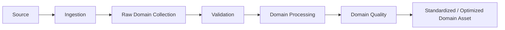

# L2 – Domain Data Processing

**Status: Conceptual**

The pipeline structure may be similar across domains, but quality rules differ by data domain. Concrete thresholds remain open.

| Domain | Quality dimensions |
|---|---|
| Orthophoto | technical readability, CRS, resolution, coverage, NoData, image quality, temporal suitability |
| LiDAR | technical readability, point density, outliers, classification, vertical reference, spatial coverage |
| CityGML | schema, IDs, geometric validity, topology, semantics, completeness, vertical reference |
