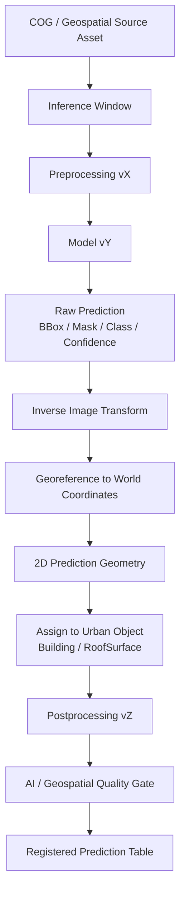

# L2 – Geospatial Inference & Postprocessing

**Status: Conceptual**

The model output is an intermediate result. This capability turns image-space detections or masks into traceable real-world geometries, connects them to canonical urban objects, checks their quality, and publishes them as governed prediction data.



## Reproducible COG inference

```text
COG in object storage → Inference Manifest → Python inference worker
                      → Rasterio / GDAL window read → NumPy / tensor → GPU model
```

COGs allow partial, range-based reads; chips normally stay in memory. Rasterio/GDAL performs the actual geospatial raster-window access. Spark may distribute large numbers of inference tasks across workers, but it is not the pixel-access mechanism.

An explicit inference manifest makes inputs traceable and retryable. It records `inference_sample_id`, `source_asset_id`, `source_snapshot`, window or bounding box, target resolution, width, height, `model_version`, and `preprocessing_version`:

```text
COG + window definition + preprocessing configuration + model version
= reproducible inference input
```

## Versioned preprocessing

Preprocessing is a first-class component, for example:

```text
COG window → band/channel selection → normalization → resize
           → letterbox/padding → tensor conversion → model input
```

Changes in channels, normalization, resolution, resize, padding, or inference transforms can change results without changing model weights. Each run therefore records a `preprocessing_version`.

## Raw predictions and inverse transformation

Raw output is retained separately and never overwritten. A record can contain `raw_prediction_id`, `inference_run_id`, model version, sample ID, class, confidence, bbox or mask, model coordinate system, and creation time. For example, `chimney`, confidence `0.91`, bbox `[183, 257, 322, 341]` is still an image-space observation.

Before georeferencing, the pipeline reverses preprocessing:

```text
Model pixel coordinates
  → undo letterbox / padding
  → undo resize
  → original chip pixel coordinates
  → add COG window offset
  → global raster pixel coordinates
  → raster GeoTransform
  → real-world CRS coordinates
```

A bbox becomes four transformed corners and then a 2D polygon, for example in EPSG:25832. A mask can instead produce a segmentation polygon. Skipping inverse preprocessing produces incorrect world coordinates even when the raster GeoTransform is correct.

## Geometry provenance and urban-object assignment

The stored `geometry_type` makes interpretation explicit:

- `bbox`: georeferenced rectangle derived from a detection box;
- `segmentation_polygon`: polygon derived from a mask;
- `clipped_bbox`: box clipped to a spatial constraint such as a roof surface;
- `reviewed_polygon`: human-corrected geometry.

A clipped box is not presented as a model-predicted exact contour.

Georeferenced predictions are associated with canonical entities by a recorded method such as `ST_Intersects`, maximum overlap, centroid-within, distance, or topology/semantic constraints:

```text
Prediction polygon → spatial relationship → RoofSurface → Building
```

The result stores, for example, `building_id=B123`, `roof_surface_id=R456`, `assignment_method=maximum_overlap`, and `assignment_score=0.94`. This is the step that turns an image prediction into an urban observation.

## Separate prediction states and postprocessing versions

Three states remain independently traceable:

1. **Raw model prediction:** bbox/mask, class, confidence, model version, image coordinates.
2. **Geospatial/postprocessed prediction:** real-world geometry and CRS, object assignments, assignment score, postprocessing version.
3. **Curated/reviewed result:** review status, corrected class or geometry, and reviewer/validation metadata.

Postprocessing is versioned independently. For example, `postprocessing_v1` may use centroid-in-roof, while `v2` uses maximum overlap and `v3` adds topology. The same raw prediction can be reprocessed with a new version without repeating expensive inference.

## Quality layers

Quality is intentionally split into three layers:

| Layer | Owner and examples |
|---|---|
| Domain Data Quality | Before AI: readable raster, valid CRS/geometry, acceptable NoData, parseable CityGML, plausible LiDAR density |
| AI / Geospatial Pipeline Quality | During inference: readable windows, successful preprocessing, valid raw output and geometry, expected area, successful/unambiguous assignment, acceptable overlap, complete run |
| Data Product Quality | After publication/dbt: unique and non-null IDs, valid references, plausible ranges, complete joins, business rules and coverage |

Relational tests do not replace the AI/geospatial quality gate.

## Publication and the dbt boundary

After its AI quality gate, the pipeline registers or publishes a versioned table such as `standardized.roof_object_predictions`. A conceptual schema includes:

| Concern | Fields |
|---|---|
| Identity and provenance | `prediction_id`, `inference_run_id`, `source_asset_id`, `source_snapshot`, `dataset_version` |
| Model lineage | `model_name`, `model_version`, `preprocessing_version`, `postprocessing_version` |
| Prediction | `object_class`, `confidence` |
| Geometry | `geometry`, `geometry_crs`, `geometry_type` |
| Assignment | `building_id`, `roof_surface_id`, `assignment_method`, `assignment_score` |
| Quality/review | `quality_status`, `quality_flags`, `review_status` |
| Metadata | `created_at` |

The exact physical schema is an L3 decision. In a Databricks implementation, the table may be governed in Unity Catalog.

The AI/geospatial pipeline owns COG access, preprocessing, inference, raw predictions, inverse transforms, pixel-to-world conversion, geometry construction and validation, urban-object assignment, AI checks, and initial publication. **dbt begins after that publication.** It owns cross-domain joins, business transformations, derived fields, aggregations, relational tests, and integrated/published analytical products.

Although `standardized.roof_object_predictions` is not raw source data, it is a **dbt source** (an upstream standardized table created outside dbt). dbt can immediately test uniqueness, nullability, confidence ranges, and building/roof references.

## Example: roof objects to PV potential

```text
Orthophoto COG → window read → Preprocessing v3 → Roof Object Model v12
→ bbox/segmentation → georeferencing → 2D polygon → RoofSurface assignment
→ Postprocessing v7 → AI Quality Gate
→ standardized.roof_object_predictions
→ dbt joins with standardized.citygml_roof_surfaces
          and standardized.lidar_building_heights
→ integrated.roofs → PV calculation / business logic → published.pv_potential
```

Once predictions pass AI-specific processing and quality checks, they become normal governed upstream data for the wider Data Platform. Monitoring and review can route selected observations back into the Active Learning loop described in [Model Lifecycle](l2-ai-model-lifecycle.md).
