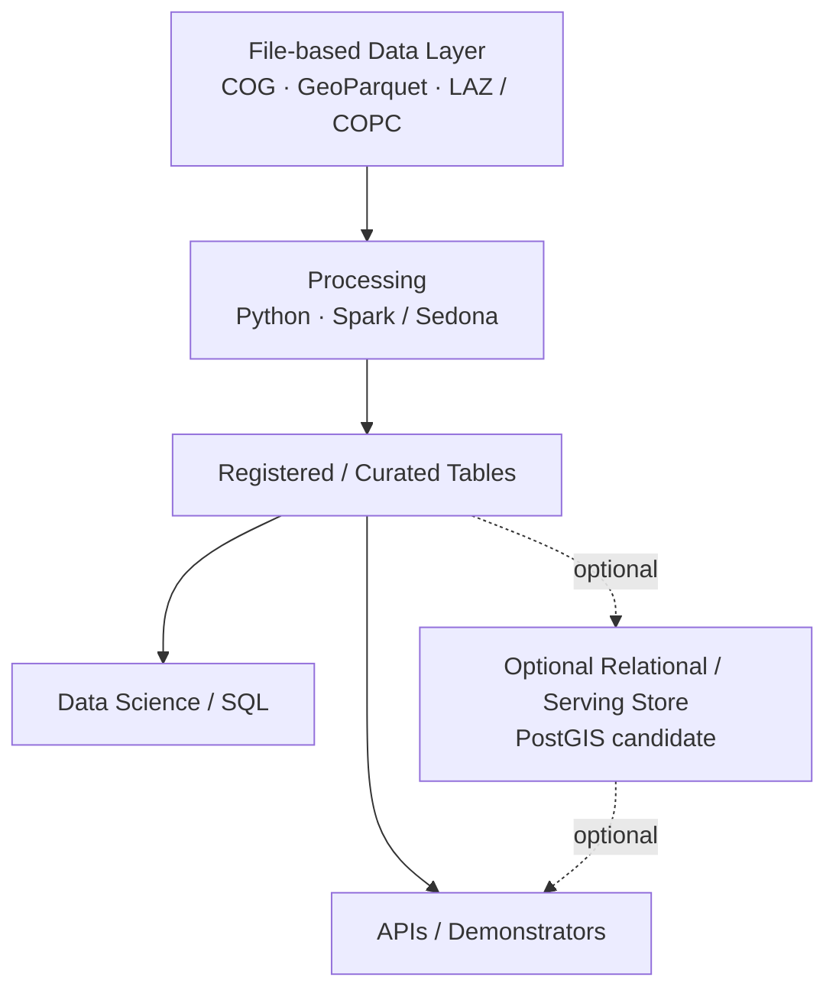
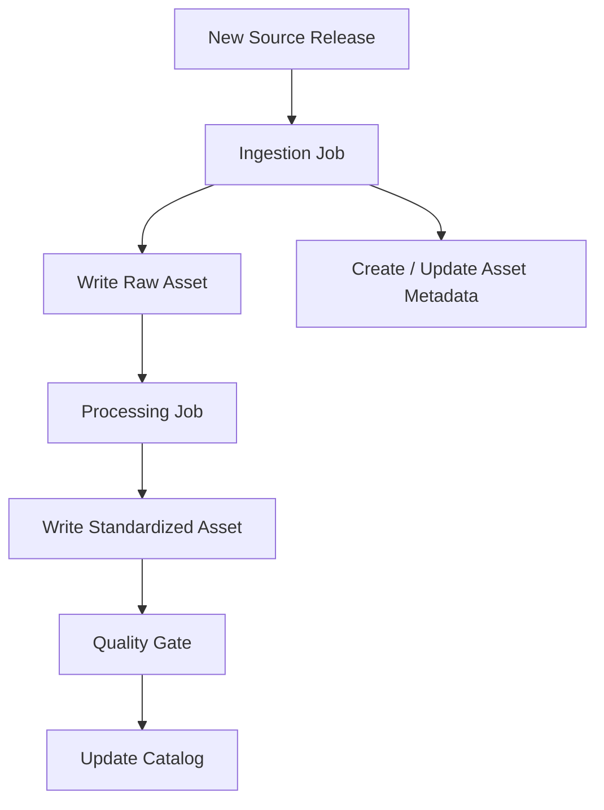

# L2 – Storage & Access

**Status: Proposed patterns; named platform products are Candidates**

Large geospatial datasets should primarily remain versioned, open, and partially readable assets. Storage and compute remain logically separate. The technology-neutral storage term is **S3-compatible Object Storage**; possible implementations include Amazon S3 and MinIO or other S3-compatible on-premises storage. No implementation is mandatory yet.

## Conceptual object-storage layout

```text
S3-compatible Object Storage

RAW
├── orthophoto
├── lidar
└── citygml

STANDARDIZED
├── orthophoto → COG
├── lidar      → LAZ / COPC candidate
└── citygml    → GeoParquet
```

`raw/` and `standardized/` may be prefixes in one bucket or separate buckets. Bucket boundaries, retention policies, and physical partitioning are L3 operational decisions.

## File-first data layer and optional serving store



PostGIS remains a Candidate where a relational spatial store, interactive serving, GIS interoperability, or 3DCityDB is demonstrably beneficial. It is not currently assumed to be a mandatory layer.

## Orthophotos: COG and dynamic access

**Proposed:** Orthophotos are standardized as COG and read partially by bounding box or window. Millions of PNG/JPEG chips are not stored permanently by default.

```text
COG + Bounding Box / Window + Dataset Manifest + Generation Parameters
= reproducible sample
```

Persistent chips are justified derivations for annotation, temporary training caches, exports, benchmarks, debugging, or measured performance needs.

## Asset Catalog

An **Asset Catalog** stores metadata and discovery references, not the large raster, point-cloud, or CityGML files themselves. A representative entry is:

```text
asset_id: ortho_2025_001
source: Bayern DOP20
capture_date: ...
bbox: ...
crs: ...
resolution: ...
raw_asset: s3://.../raw/.../001.tif
standardized_asset: s3://.../standardized/.../001.tif
quality_status: passed
```

Catalog metadata is maintained by the pipelines:



Humans should not manually maintain one metadata file per tile. Ingestion and processing pipelines create and update the relevant catalog entries.

### STAC / Geospatial Asset Catalog

**Candidate:** STAC supports spatial and temporal discovery of file-based assets by bounding box, acquisition date, collection, source, file location, and asset version. Typical assets include COG, LiDAR/COPC, and other large spatiotemporal files. An initial implementation may use static JSON/catalog metadata and later add a searchable STAC API/index if scale requires it. STAC need not represent the complete canonical relational entity model.

### Databricks Unity Catalog

**Candidate, if Databricks is selected:** Unity Catalog has a different role: governance of files through Volumes, registration and governance of tables and views, access control, discoverability, and the `catalog.schema.table` namespace.

```text
urban_ai_lab
└── standardized
    ├── citygml_buildings
    ├── citygml_roof_surfaces
    └── lidar_building_heights
```

STAC and Unity Catalog are complementary rather than competing concepts. STAC is primarily an asset/discovery catalog for geospatial files; Unity Catalog is a Databricks platform governance/catalog layer for files, tables, and views.

## LiDAR access

```text
Raw LAS / LAZ → validation and processing
              → standardized LAZ / COPC candidate
              → partial spatial access and analysis
```

COPC remains a Candidate rather than a binding decision.

## CityGML representation: open decision

### Option A – File-first analytical model

```text
Raw CityGML
→ parsing / normalization
→ Python / PySpark + Sedona
→ GeoParquet
→ register as tables
→ SQL / dbt
```

Advantages to evaluate include an open file-based representation, storage/compute separation, scalable parallel processing, Data Science fit, GeoParquet interoperability, and potential Sedona predicate pushdown and distributed spatial processing. Costs include implementing or selecting robust parsing and semantic normalization, preserving hierarchy in an analytical model, and avoiding unnecessary Spark complexity for small workloads.

### Option B – 3DCityDB / PostGIS

```text
Raw CityGML
→ 3DCityDB citydb-tool
→ 3DCityDB relational model
→ PostgreSQL / PostGIS
```

Advantages to evaluate include a mature CityGML-specific relational model, existing import/export tooling, and an established mapping of CityGML semantics. Questions include its database-centric nature, schema complexity for analytical use cases, fit with Spark/Sedona and Data Lake workflows, and whether its additional value justifies a core platform dependency. The old 3DCityDB v4 Importer/Exporter is not the preferred basis for a new architecture; evaluation of this option must use current 3DCityDB v5 and `citydb-tool`.

### Option C – Hybrid

```text
Raw CityGML
→ 3DCityDB for semantic management
→ selected analytical exports
→ GeoParquet
```

This is an option to evaluate, not the default. Responsibilities must be separated and each concern must have one authoritative representation, otherwise duplicate sources of truth are introduced.
