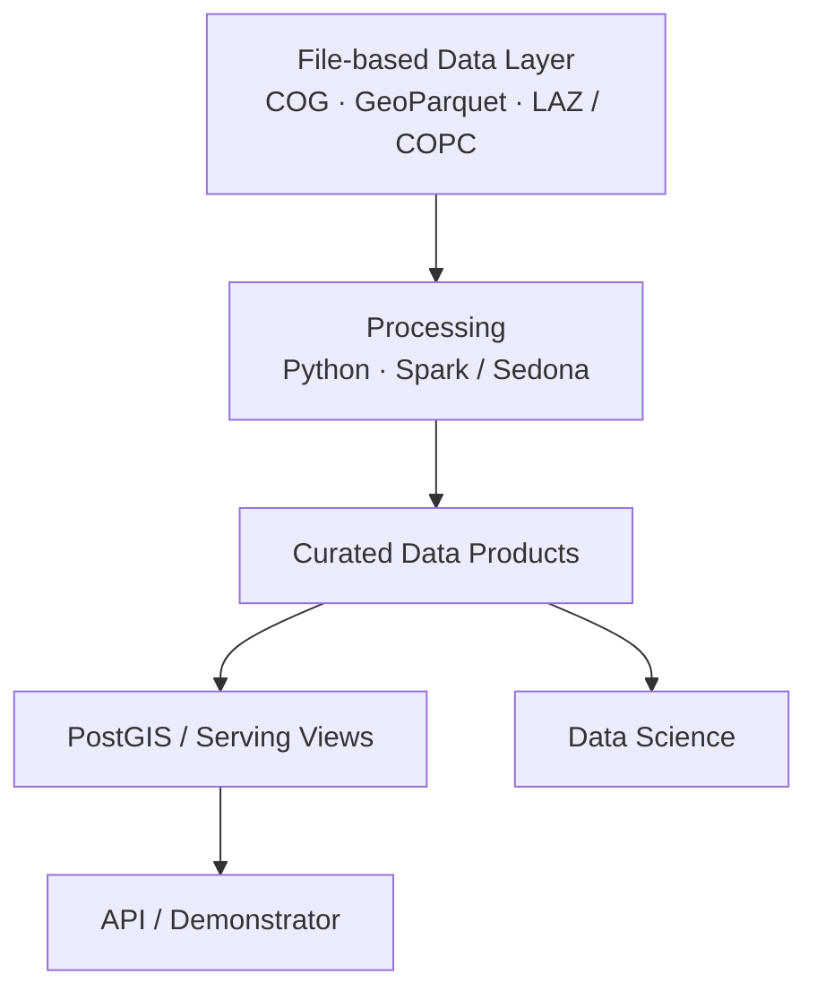

# L2 – Storage & Access

**Status: Proposed patterns**

Große Geodaten sollen primär als versionierte, offene und partiell lesbare Assets vorliegen. Ausschnitte und Zwischenprodukte entstehen möglichst on demand oder als Cache statt als dauerhafte Kopien. Storage und Compute bleiben logisch getrennt.

## File-first Data Layer



Große Datenbestände müssen nicht vollständig in einer zentralen Datenbank materialisiert werden.

## Orthophoto: COG + Dynamic Window Access

**Proposed:** Orthophotos werden als COG standardisiert und über Bounding Box oder Window partiell gelesen. Millionen PNG-/JPEG-Chips sollen nicht standardmäßig dauerhaft gespeichert werden.

```text
COG + Bounding Box / Window + Dataset Manifest + Generierungsparameter
= reproduzierbarer Sample
```

Persistente Chips sind begründete Ableitungen, etwa für Annotation, temporäre Training-Caches, Exporte, Benchmarks, Debugging oder Performanceoptimierung.

## Dataset Manifest statt Dataset-Kopie

Dataset-Versionen erfassen primär Auswahl, Referenzen, Labels, Splits und Generierungslogik:

```yaml
dataset: roof_objects_v1
samples:
  - source_asset: ortho_2025_tile_001
    bbox: [x_min, y_min, x_max, y_max]
    label_reference: label_001
chip_generation:
  width: 1024
  height: 1024
  overlap: 128
  bands: [R, G, B]
split:
  strategy: spatial
  version: v1
```

## Catalog / STAC Pattern

**Candidate:** Ein STAC-basierter Katalog referenziert Assets im Object- oder File Storage und beantwortet Lage, Abdeckung, Zeitpunkt, Collection und Version. Eine produktive STAC-Infrastruktur ist noch nicht festgelegt.

## LiDAR

```text
Raw LAS / LAZ → optimierte Punktwolkenrepräsentation
              → partieller räumlicher Zugriff → Analyse
```

COPC ist ein Kandidat, keine verbindliche Festlegung.

## CityGML und skalierbare Verarbeitung

Raw CityGML bleibt erhalten. Nach Parsing, semantischer Normalisierung und GML-Geometriekonvertierung kann GeoParquet als file-basierte analytische Repräsentation dienen.

```text
Raw CityGML → Parsing / Normalization → GeoParquet → Data Science
```

**Candidate:** PySpark ist eine verteilte Processing Engine; Apache Sedona ergänzt räumliche Datentypen, Funktionen, Spatial Joins und geospatial File Processing. Sedona versteht CityGML-Semantik nicht automatisch: Hierarchie und Geometrien müssen zuerst explizit aufbereitet werden.

Konzeptionelle Produkte sind `buildings`, `roof_surfaces` und `wall_surfaces` mit internen und ursprünglichen IDs, Geometrie, Attributen und Source-Version. Das sind keine finalen Schemas.

Spark / Sedona eignet sich für große Bestände, wiederkehrende Batch-Jobs, Spatial Joins und parallele Feature-Berechnung. Für einzelne Dateien, wenige Tausend Gebäude oder lokale Experimente kann lokales Python-/Geo-Processing angemessener sein.

## Rolle von PostGIS

**Candidate:** PostGIS dient kuratierten räumlichen Tabellen, interaktiven Abfragen, APIs, Views, Demonstratoren und Objektintegration. Es ist nicht automatisch Primärspeicher für vollständige Rasterbestände, Roh-Punktwolken, jede CityGML-Repräsentation oder temporäre Trainingschips.
