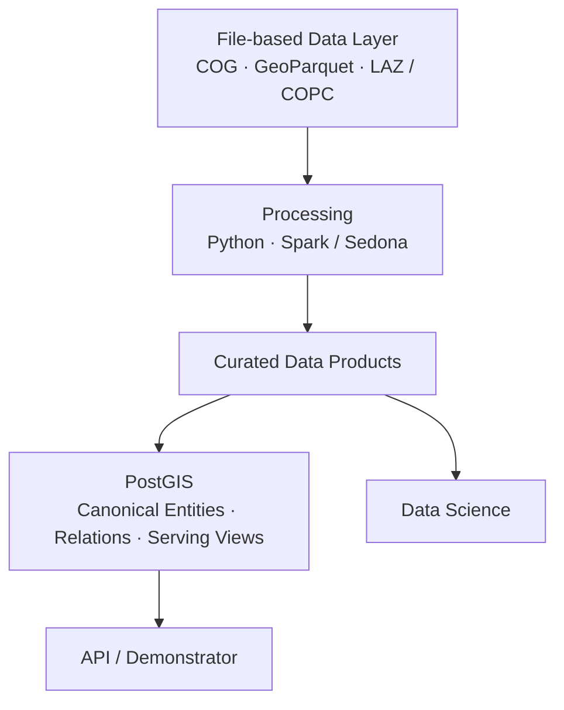

# L2 – Storage & Access

**Status: Proposed patterns**

Large geospatial datasets should primarily remain versioned, open, and partially readable assets. Subsets and intermediate products are generated on demand or cached where possible instead of being stored as permanent copies. Storage and compute remain logically separate.

## File-first data layer



Large datasets do not need to be fully materialized in one central database. File storage holds large assets and analytical data; PostGIS may hold curated objects, relationships, and serving-oriented views.

## Orthophotos: COG and dynamic window access

**Proposed:** Orthophotos are standardized as COG and read partially by bounding box or window. Millions of PNG or JPEG chips should not be stored permanently by default.

```text
COG + Bounding Box / Window + Dataset Manifest + Generation Parameters
= reproducible sample
```

Persistent chips are justified derivations for annotation, temporary training caches, exports, benchmarks, debugging, or performance optimization.

## Dataset manifest instead of dataset copy

Dataset versions primarily capture selection, references, labels, splits, and generation logic:

```yaml
dataset: roof_objects_v1
samples:
  - source_asset: ortho_2025_tile_001
    bbox: [x_min, y_min, x_max, y_max]
    label_reference: label_001
chip_generation:
  width: 1024
  height: 1024
  overlap: 128
  bands: [R, G, B]
split:
  strategy: spatial
  version: v1
```

## Catalog and STAC pattern

**Candidate:** A STAC-based catalog references assets in object or file storage and describes location, coverage, time, collection, and version. STAC is well suited to spatiotemporal file assets such as COG and LiDAR, but need not catalog the complete relational entity and feature model. A production STAC implementation has not been selected.

## LiDAR

```text
Raw LAS / LAZ → optimized point-cloud representation
              → partial spatial access → analysis
```

COPC is a candidate, not a binding decision.

## CityGML and scalable processing

Raw CityGML remains preserved. After parsing, semantic normalization, and GML geometry conversion, GeoParquet can serve as a file-based analytical projection.

```text
Raw CityGML → Parsing / Normalization → GeoParquet → Data Science
```

GeoParquet does not replace CityGML. The projection must preserve hierarchy, semantics, source identifiers, and provenance across products such as `buildings`, `building_parts`, `roof_surfaces`, and `wall_surfaces`.

**Candidate:** PySpark is a distributed processing engine; Apache Sedona adds spatial types, functions, joins, and geospatial file processing. Sedona does not automatically understand CityGML semantics, so hierarchy and geometries must first be prepared explicitly.

Spark / Sedona may suit large inventories, recurring batch jobs, spatial joins, and parallel feature computation. Local Python or geospatial processing may be more appropriate for individual files, a few thousand buildings, or local experiments. This choice should be benchmarked with real Augsburg CityGML data before becoming a standard.

## Role of PostGIS

**Candidate:** PostGIS supports curated spatial tables, a compact canonical entity model, relationships, interactive queries, APIs, views, and demonstrators. It is not automatically the primary store for complete raster inventories, raw point clouds, every CityGML representation, or temporary training chips.
