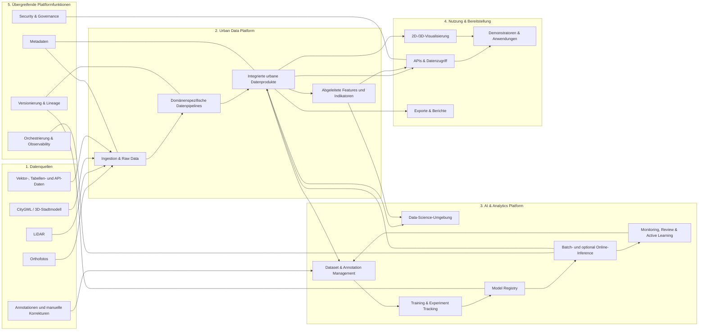

# Urban AI Lab Architecture Repository – Implementation Instructions

## 1. Auftrag

Erstelle ein neues Git-Repository für die technische Architektur- und Plattformdokumentation des **Urban AI Lab**.

Das Repository soll als langfristige, versionierte und erweiterbare **technische Quelle der Wahrheit** dienen. Es soll eine verständliche Gesamtarchitektur präsentieren und gleichzeitig ermöglichen, schrittweise in einzelne Datenarten, Datenprodukte, Pipelines, KI-Komponenten und Use Cases hineinzuzoomen.

Die Dokumentation soll nach dem **Docs-as-Code-Prinzip** aufgebaut werden:

- Markdown als primäres Dokumentationsformat
- Git für Versionierung und Review
- MkDocs Material als Dokumentationswebsite
- Mermaid für textbasierte Diagramme
- Draw.io für visuell ausgearbeitete Architekturdiagramme
- Architecture Decision Records für wichtige Entscheidungen
- YAML für strukturierte Metadaten und spätere Datenverträge
- automatischer Build und grundlegende Qualitätsprüfungen über CI

Die erste Version ist eine **Architektur- und Dokumentationsbasis**, keine produktive Daten- oder KI-Plattform.

---

# 2. Zielbild

Das Urban AI Lab soll langfristig heterogene urbane Datenquellen in qualitätsgesicherte, versionierte und wiederverwendbare Datenprodukte überführen und diese für Datenanalyse, KI-Modelle, APIs, Visualisierungen und Demonstratoren bereitstellen.

Die langfristige logische Kette lautet:

```text
Urbane Quelldaten
→ domänenspezifische Ingestion und Qualitätssicherung
→ standardisierte Datenbestände
→ integrierte urbane Datenprodukte
→ Data Science und KI
→ neue urbane Informationen
→ APIs, Visualisierung und Demonstratoren
→ Feedback, Review und kontinuierliche Verbesserung
```

Zu den relevanten Quelldaten gehören zunächst:

- Orthofotos
- LiDAR-Punktwolken
- CityGML- beziehungsweise 3D-Stadtmodelle
- Vektordaten
- Tabellen
- externe APIs
- Annotationen
- manuelle Korrekturen
- Modellvorhersagen

---

# 3. Wichtige Architekturprinzipien

Dokumentiere die folgenden Prinzipien explizit und berücksichtige sie in der Repository-Struktur und in allen Diagrammen.

## 3.1 Groß beginnen, kontrolliert vertiefen

Die Dokumentation soll mehrere Zoomstufen besitzen:

```text
L0 – Vision
L1 – Gesamtarchitektur
L2 – Plattform- oder Domänenarchitektur
L3 – konkrete Pipeline oder Use Case
L4 – technische Implementierung
```

Die erste Version soll L0 und L1 vollständig enthalten.  
L2 soll als Struktur und teilweise als Entwurf angelegt werden.  
L3 und L4 sollen zunächst hauptsächlich durch Templates und einen ersten Orthofoto-Vertical-Slice vorbereitet werden.

## 3.2 Domänenspezifische Qualitätssicherung

Es darf keinen einzelnen generischen Prozess geben, der vorgibt, alle Datenarten gleich zu prüfen.

Stattdessen besitzt jede Datenart ihre eigene Pipeline und eigene Qualitätslogik:

```text
Orthofoto-Pipeline
├── Orthofoto-spezifische Prüfungen
└── Orthofoto-Datenprodukt

LiDAR-Pipeline
├── LiDAR-spezifische Prüfungen
└── LiDAR-Datenprodukt

CityGML-Pipeline
├── CityGML-spezifische Prüfungen
└── CityGML-Datenprodukt

Prediction-Pipeline
├── modelloutput-spezifische Prüfungen
└── Prediction-Datenprodukt
```

Übergreifend standardisiert werden lediglich:

- Metadaten
- Statuswerte
- Versionierung
- Datenherkunft
- Lineage
- Verantwortlichkeiten
- Veröffentlichungsprozesse
- Qualitätsberichte
- Auditierbarkeit

Die zentrale Aussage lautet:

> Qualitätsprüfung ist dezentral und datentypspezifisch. Qualitätsmanagement ist übergreifend standardisiert.

## 3.3 Datenprodukte statt lose Dateien

Dokumentiere Daten nicht nur als Dateien oder Tabellen, sondern als Datenprodukte.

Ein Datenprodukt besitzt mindestens:

- Namen
- Zweck
- Owner
- Nutzer
- Eingangsdaten
- Ausgangsdaten
- Schnittstellen
- Qualitätsversprechen
- Aktualisierungsprozess
- Version
- Abhängigkeiten
- Status
- bekannte Einschränkungen

Beispiele:

- Orthophoto Collection Augsburg
- LiDAR Collection Augsburg
- City Building Model
- Integrated Building Dataset
- Roof Object Predictions
- PV Potential Dataset
- Urban Heat Indicators

## 3.4 Rohdaten bleiben unverändert

Originaldaten sollen konzeptionell unverändert und nachvollziehbar erhalten bleiben.

Transformationen erzeugen neue Repräsentationen oder Datenproduktversionen:

```text
Source Asset
→ Standardized Asset
→ Curated Object
→ Derived Feature
→ Model Prediction
→ Reviewed Result
→ Published Data Product
```

## 3.5 Herkunft und Versionierung

Abgeleitete Werte, Modellvorhersagen und veröffentlichte Merkmale müssen langfristig auf ihre Quellen und Verarbeitungsschritte zurückgeführt werden können.

Dokumentiere daher konzeptionell mindestens:

- Source Dataset
- Source Asset
- Pipeline Run
- Code Version
- Dataset Version
- Model Version
- Preprocessing Version
- Postprocessing Version
- Quality Status
- Review Status
- Valid Time
- Creation Time

## 3.6 Modulare KI-Plattform

Die KI-Plattform ist kein einzelnes monolithisches Produkt.

Sie besteht langfristig aus austauschbaren Fähigkeiten:

- Data-Science-Umgebung
- Dataset Management
- Annotation
- Label Review
- Training
- Experiment Tracking
- Model Registry
- Preprocessing
- Postprocessing
- Batch Inference
- optional Online Inference
- Monitoring
- Active Learning
- manuelle Review-Prozesse
- Rückschreiben in urbane Datenprodukte

Nicht jeder Use Case benötigt alle Komponenten.

## 3.7 Batch First

Die erste Architektur soll Batch-Verarbeitung priorisieren.

Begründung:

- urbane Daten werden häufig flächen- oder bestandsbezogen verarbeitet
- Orthofotos, LiDAR und CityGML werden typischerweise in größeren Läufen analysiert
- Batch-Prozesse sind zunächst einfacher reproduzierbar
- Online Serving soll architektonisch möglich bleiben, aber nicht als erste Priorität dargestellt werden

## 3.8 Technologieoffenheit

Die erste Version soll logische Komponenten und Fähigkeiten dokumentieren, ohne unnötig früh konkrete Infrastrukturprodukte festzuschreiben.

Noch nicht final festlegen:

- Cloud-Anbieter
- Kubernetes
- Workflow-Orchestrator
- Annotationstool
- Model-Serving-System
- Feature Store
- konkrete Datenbanktopologie
- vollständiges Monitoring-Produkt

Technologien dürfen als Kandidaten oder Beispiele genannt werden, aber nicht ohne dokumentierte Entscheidung als verpflichtend dargestellt werden.

---

# 4. Dokumentationsstrategie

## 4.1 Git als technische Quelle der Wahrheit

Das Git-Repository ist der verbindliche Ort für:

- Architektur
- Datenplattform
- KI-Plattform
- Datenprodukte
- Domänendokumentationen
- Pipelines
- technische Standards
- Architecture Decision Records
- Diagrammquellen
- strukturierte Verträge
- Implementierungsstatus
- offene technische Fragen

## 4.2 MkDocs als lesbare Oberfläche

Erzeuge eine MkDocs-Material-Website aus dem Repository.

Die Website soll:

- eine klare Navigation besitzen
- eine Startseite mit Zielbild enthalten
- Volltextsuche ermöglichen
- Mermaid-Diagramme darstellen
- auf Draw.io-Exporte verweisen
- für technische und nicht-technische Leser verständlich sein
- lokal ohne externe Dienste gebaut werden können

## 4.3 Confluence als optionale Einstiegsebene

Confluence ist nicht Teil dieses Repositories.

Dokumentiere jedoch im Repository folgende empfohlene Rollenverteilung:

### Confluence

- Landingpage
- Vision
- Roadmap
- Teamorganisation
- Meetingnotizen
- Workshop-Ergebnisse
- Onboarding
- Links auf die technische Dokumentationswebsite

### Git und MkDocs

- technische Quelle der Wahrheit
- Architektur
- Datenprodukte
- Datenverträge
- Pipelines
- Entscheidungen
- Diagrammquellen
- Implementierungsdetails

Es sollen keine vollständigen Kopien derselben technischen Dokumente parallel in Confluence und Git gepflegt werden.

---

# 5. Zu erstellende Repository-Struktur

Erstelle mindestens folgende Struktur:

```text
urban-ai-lab-architecture/
│
├── README.md
├── CONTRIBUTING.md
├── LICENSE
├── .gitignore
├── mkdocs.yml
├── requirements-docs.txt
├── Makefile
│
├── docs/
│   ├── index.md
│   │
│   ├── 00_overview/
│   │   ├── vision.md
│   │   ├── scope.md
│   │   ├── architecture-principles.md
│   │   ├── documentation-strategy.md
│   │   └── roadmap.md
│   │
│   ├── 01_overall-architecture/
│   │   ├── system-context.md
│   │   ├── capability-map.md
│   │   ├── logical-architecture.md
│   │   ├── end-to-end-data-flow.md
│   │   └── cross-cutting-capabilities.md
│   │
│   ├── 02_data-platform/
│   │   ├── overview.md
│   │   ├── ingestion-and-storage.md
│   │   ├── data-products.md
│   │   ├── integrated-urban-data-model.md
│   │   ├── metadata-versioning-lineage.md
│   │   └── data-access.md
│   │
│   ├── 03_data-domains/
│   │   ├── overview.md
│   │   ├── orthophotos/
│   │   │   ├── overview.md
│   │   │   ├── pipeline.md
│   │   │   ├── quality.md
│   │   │   └── open-questions.md
│   │   │
│   │   ├── lidar/
│   │   │   ├── overview.md
│   │   │   ├── pipeline.md
│   │   │   ├── quality.md
│   │   │   └── open-questions.md
│   │   │
│   │   ├── citygml/
│   │   │   ├── overview.md
│   │   │   ├── pipeline.md
│   │   │   ├── quality.md
│   │   │   └── open-questions.md
│   │   │
│   │   └── external-data/
│   │       ├── overview.md
│   │       └── open-questions.md
│   │
│   ├── 04_ai-platform/
│   │   ├── overview.md
│   │   ├── datasets-and-annotations.md
│   │   ├── training-and-experiments.md
│   │   ├── model-registry.md
│   │   ├── preprocessing-and-postprocessing.md
│   │   ├── inference.md
│   │   ├── monitoring.md
│   │   └── active-learning.md
│   │
│   ├── 05_data-products/
│   │   ├── overview.md
│   │   ├── orthophoto-collection.md
│   │   ├── lidar-collection.md
│   │   ├── city-building-model.md
│   │   ├── integrated-buildings.md
│   │   ├── model-predictions.md
│   │   └── derived-indicators.md
│   │
│   ├── 06_use-cases/
│   │   ├── overview.md
│   │   └── roof-object-detection/
│   │       ├── overview.md
│   │       ├── vertical-slice.md
│   │       ├── data-flow.md
│   │       ├── ml-lifecycle.md
│   │       └── open-questions.md
│   │
│   ├── 07_interfaces/
│   │   ├── overview.md
│   │   ├── data-science-access.md
│   │   ├── apis.md
│   │   ├── geospatial-services.md
│   │   ├── visualization.md
│   │   └── demonstrators.md
│   │
│   ├── 08_operations/
│   │   ├── overview.md
│   │   ├── deployment.md
│   │   ├── observability.md
│   │   ├── security-and-governance.md
│   │   ├── backup-and-recovery.md
│   │   └── cost-and-resource-management.md
│   │
│   ├── 09_decisions/
│   │   └── index.md
│   │
│   ├── 10_templates/
│   │   ├── data-domain-template.md
│   │   ├── data-product-template.md
│   │   ├── pipeline-template.md
│   │   ├── use-case-template.md
│   │   └── adr-template.md
│   │
│   └── assets/
│       ├── diagrams/
│       └── images/
│
├── decisions/
│   ├── ADR-001-docs-as-code.md
│   ├── ADR-002-domain-specific-quality.md
│   ├── ADR-003-data-product-approach.md
│   ├── ADR-004-immutable-raw-data.md
│   └── ADR-005-batch-first.md
│
├── diagrams/
│   ├── drawio/
│   ├── svg/
│   └── README.md
│
├── contracts/
│   ├── README.md
│   ├── data-products/
│   ├── datasets/
│   └── predictions/
│
├── scripts/
│   ├── check-links.sh
│   └── validate-yaml.py
│
└── .github/
    ├── workflows/
    │   └── docs.yml
    ├── ISSUE_TEMPLATE/
    │   ├── architecture-change.md
    │   └── documentation-gap.md
    └── pull_request_template.md
```

Falls GitLab verwendet wird, darf zusätzlich oder alternativ eine `.gitlab-ci.yml` angelegt werden.  
Die GitHub-Variante soll jedoch standardmäßig implementiert werden.

---

# 6. MkDocs-Konfiguration

Verwende:

- MkDocs
- Material for MkDocs
- Mermaid-Unterstützung
- Markdown Extensions für Tabellen, Admonitions, Codeblöcke und Inhaltsverzeichnisse

Die Website soll mindestens enthalten:

- übersichtliche Navigation
- Repository-Link
- Suchfunktion
- Edit-Link, sofern ohne externe Abhängigkeit konfigurierbar
- deutsche Hauptsprache
- gut lesbare Standarddarstellung
- keine unnötige visuelle Überladung

Die `requirements-docs.txt` soll mindestens geeignete Versionen der benötigten Dokumentationspakete enthalten.

Die Dokumentation muss lokal mit folgendem Befehl gebaut werden können:

```bash
make docs-build
```

Lokale Vorschau:

```bash
make docs-serve
```

Der Build soll intern ausführen:

```bash
mkdocs build --strict
```

---

# 7. Inhalt der ersten Dokumentationsversion

## 7.1 Startseite

Die Startseite soll erklären:

- was das Urban AI Lab ist
- welches Problem die Plattform löst
- welche Datenarten betrachtet werden
- wie die Dokumentation aufgebaut ist
- wie Nutzer in die Architektur hineinzoomen können
- welche Teile aktuell Entwurf, Zielbild oder zukünftige Arbeit sind

Die Startseite soll direkt auf folgende Bereiche verlinken:

- Vision
- Gesamtarchitektur
- Urban Data Platform
- AI Platform
- Data Domains
- Data Products
- Roof Object Detection Vertical Slice
- Architecture Decisions
- Roadmap

## 7.2 Vision

Dokumentiere folgende Vision:

> Das Urban AI Lab schafft eine modulare, nachvollziehbare und wiederverwendbare Daten- und KI-Infrastruktur, mit der heterogene urbane Datenquellen integriert, qualitätsgesichert, analysiert und in anwendbare Informationen für Forschung, Lehre und urbane Entscheidungsunterstützung überführt werden.

## 7.3 Scope

### Im Scope der Architektur

- urbane Geodaten
- Orthofotos
- LiDAR
- CityGML
- Vektordaten
- externe Tabellen und APIs
- Dateningestion
- Standardisierung
- domänenspezifische Qualitätssicherung
- urbane Datenprodukte
- Feature-Berechnung
- Umgang mit fehlenden Werten
- Data-Science-Zugriff
- Dataset Management
- Annotation
- Training
- Modellversionierung
- Batch Inference
- Monitoring
- Active Learning
- APIs
- Visualisierung
- Demonstratoren
- Rückschreiben von Ergebnissen
- Metadaten
- Lineage
- Governance

### Zunächst nicht im Scope der Implementierung

- produktionsfertige Cloud-Infrastruktur
- vollständiger Kubernetes-Betrieb
- produktives Online Serving
- vollständiges Identity- und Access-Management
- produktive Datenpipelines
- produktive Datenbankmigrationen
- produktive Modelltrainings
- Auswahl aller finalen Plattformprodukte

---

# 8. Gesamtarchitektur

Erstelle in `docs/01_overall-architecture/logical-architecture.md` ein Mermaid-Diagramm mit folgenden Hauptbereichen:

```text
1. Datenquellen
2. Urban Data Platform
3. AI & Analytics Platform
4. Nutzung & Bereitstellung
5. Übergreifende Plattformfunktionen
```

Die logische Architektur soll ungefähr diese Struktur besitzen:



Das Diagramm darf verbessert werden, soll aber nicht mehr als ungefähr 15 bis 20 sichtbare Hauptkomponenten enthalten.

---

# 9. Capability Map

Erstelle eine Capability Map, keine konkrete Tool-Liste.

Mindestens folgende Fähigkeiten sollen enthalten sein:

## Data Platform

- Source Onboarding
- Raw Data Management
- Format Validation
- Spatial Standardization
- Domain-specific Quality Assurance
- Metadata Management
- Versioning
- Data Lineage
- Object Integration
- Feature Calculation
- Missing Value Handling
- Data Product Publishing
- Data Access

## AI Platform

- Dataset Creation
- Dataset Versioning
- Annotation
- Label Review
- Pre-Labeling
- Experiment Tracking
- Training
- Evaluation
- Model Registry
- Preprocessing
- Postprocessing
- Batch Inference
- Online Inference
- Monitoring
- Active Learning
- Human Review
- Prediction Write-back

## Exposure

- SQL Access
- Notebook Access
- File Access
- APIs
- Geospatial Services
- 2D Visualization
- 3D Visualization
- Dashboards
- Demonstrators
- Exports

## Cross-cutting

- Authentication
- Authorization
- Licensing
- Privacy
- Observability
- Resource Management
- CI/CD
- Documentation
- Ownership
- Auditability

Kennzeichne Fähigkeiten als:

- Current
- Planned
- Optional
- Future

Da noch kein Ist-Zustand vollständig dokumentiert ist, dürfen zunächst konservative Platzhalter verwendet werden. Diese müssen sichtbar als Annahmen markiert werden.

---

# 10. Data Domains

Für Orthofotos, LiDAR und CityGML soll jeweils eine eigene Domänenseite angelegt werden.

Die Detailtiefe soll zunächst moderat bleiben.

Jede Domänenseite soll mindestens enthalten:

1. Zweck
2. typische Quellen
3. wichtigste Datenformate
4. logischer Ingestion-Ablauf
5. domänenspezifische Qualitätsdimensionen
6. Ziel-Datenprodukt
7. Schnittstellen
8. Beziehungen zu anderen Domänen
9. bekannte offene Fragen
10. Status

## 10.1 Orthofotos

Dokumentiere auf Übersichtsebene:

- Raster-Assets und Collections
- Metadaten
- CRS
- Ground Sample Distance
- Bänder
- NoData
- räumliche Abdeckung
- zeitliche Abdeckung
- Kacheln
- Cloud-optimierte Repräsentation als mögliche Zielrepräsentation
- Nutzung für Training und Inference
- Ableitung reproduzierbarer Chips
- Verwendung als Quelle für Objekterkennung

Qualitätsdimensionen nur als Kategorien darstellen:

- technische Lesbarkeit
- Metadatenvollständigkeit
- räumliche Konsistenz
- radiometrische Qualität
- Bildschärfe
- NoData und Lücken
- zeitliche Eignung
- Use-Case-Eignung

Keine vollständige Liste konkreter Schwellenwerte definieren.

## 10.2 LiDAR

Dokumentiere auf Übersichtsebene:

- Punktwolken
- Tiles
- Punktdichte
- Klassifikation
- Scan- und Erfassungsinformationen
- horizontale und vertikale Referenz
- Nutzung für Gelände, Höhe, Vegetation und Gebäude

Qualitätsdimensionen:

- technische Lesbarkeit
- Header und Metadaten
- Punktdichte
- räumliche Abdeckung
- Ausreißer
- Klassifikationsqualität
- Streifen- und Tile-Konsistenz
- Eignung für den jeweiligen Use Case

## 10.3 CityGML

Dokumentiere auf Übersichtsebene:

- Gebäude
- Building Parts
- semantische Flächen
- Levels of Detail
- IDs
- Geometrien
- Attribute
- CRS
- Höhenreferenz

Qualitätsdimensionen:

- Schema
- Eindeutigkeit von IDs
- geometrische Validität
- Topologie
- semantische Konsistenz
- Vollständigkeit
- Höhenbezug
- räumliche Aktualität

---

# 11. Integrated Urban Data Model

Erstelle eine konzeptionelle Beschreibung eines integrierten urbanen Objektmodells.

Noch kein finales physisches Datenbankschema.

Mindestens folgende Kernobjekte sollen dargestellt werden:

```text
Area
Parcel
Building
BuildingPart
RoofSurface
FacadeSurface
Opening
RoofObject
Road
VegetationObject
Observation
DerivedFeature
Prediction
Annotation
QualityResult
ReviewDecision
SourceDataset
SourceAsset
PipelineRun
ModelVersion
```

Die wichtigste konzeptionelle Idee:

- Datenquellen bleiben eigenständige Datenprodukte
- urbane Objekte erhalten interne stabile IDs
- Quell-IDs werden als Referenzen gespeichert
- Beobachtungen, Features und Predictions werden nicht unkontrolliert in eine einzelne breite Tabelle geschrieben
- Provenance und Versionierung bleiben erhalten

Verwende ein einfaches Mermaid-ER-Diagramm oder ein konzeptionelles Klassendiagramm.

Kennzeichne das Modell sichtbar als:

```text
Status: Conceptual Draft
```

---

# 12. Umgang mit fehlenden und abgeleiteten Werten

Erstelle eine eigene Sektion in der Data-Platform-Dokumentation.

Die zentrale Regel lautet:

> Fehlende Werte dürfen nicht stillschweigend durch geschätzte Werte ersetzt werden.

Unterscheide mindestens:

- observed
- imported
- calculated
- predicted
- imputed
- manually_validated
- manually_corrected

Beschreibe konzeptionell, dass ein Wert zusätzlich Informationen besitzen kann wie:

- method
- source
- version
- quality status
- uncertainty
- valid time
- creation time

Verwende ein kurzes Beispiel, aber definiere noch kein finales Datenbankschema.

---

# 13. AI Platform

Erstelle eine übersichtliche, modulare Darstellung.

## 13.1 Dataset und Annotation Management

Dokumentiere:

- Dataset Manifests
- Dataset Versions
- Train/Validation/Test Splits
- räumliche Splits
- Label Versions
- Annotation Ontology
- Pre-Labeling
- Review
- Quality Assurance
- Active-Learning Queues

## 13.2 Training und Experimente

Ein Training Run soll konzeptionell referenzieren:

- Dataset Version
- Label Version
- Code Commit
- Configuration
- Container Version
- Initial Weights
- Model Architecture
- Random Seed
- Hardware
- Metrics
- Evaluation Results

## 13.3 Model Registry

Dokumentiere:

- Model Name
- Model Version
- Training Run
- Dataset Version
- Evaluation Status
- Approval Status
- Deployment Status
- Limitations

## 13.4 Preprocessing und Postprocessing

Diese Komponenten müssen als eigene Teile des Modellsystems dargestellt werden:

```text
Input Adapter
→ Preprocessing
→ Model
→ Postprocessing
→ Quality Gate
→ Prediction Writer
```

## 13.5 Inference

Unterscheide:

### Batch Inference

Primärer Startpunkt.

### Online Inference

Optional und später.

## 13.6 Monitoring

Monitoring umfasst nicht nur Accuracy.

Dokumentiere als Kategorien:

- System Metrics
- Pipeline Metrics
- Data Quality
- Input Drift
- Output Drift
- Model Performance
- Spatial Performance
- Review Rate
- Correction Rate
- Cost
- Runtime
- Coverage
- Failure Patterns

## 13.7 Active Learning

Erstelle ein Prozessdiagramm:

```text
Inference
→ Unsicherheit und Qualitätsregeln
→ Auswahlstrategie
→ Review Queue
→ Annotation
→ Label Quality
→ neue Dataset Version
→ Training
→ Evaluation Gate
→ neue Model Version
→ erneute Inference
```

---

# 14. Roof Object Detection Vertical Slice

Dieser Use Case dient als erstes konkreteres Beispiel.

Dokumentiere folgenden Ablauf:

```text
Orthofoto Source
→ Orthofoto Ingestion
→ Orthofoto-spezifische Qualitätssicherung
→ veröffentlichte Orthophoto Collection
→ reproduzierbare Chip-Erzeugung
→ Dataset beziehungsweise Inference Manifest
→ Preprocessing
→ Object Detection Model
→ Postprocessing
→ Georeferenzierung
→ Tile- und Chip-Merging
→ Prediction Quality
→ Zuordnung zu Gebäuden oder Dachflächen
→ Review Queue
→ versionierte Predictions
→ freigegebene urbane Merkmale
→ API oder Demonstrator
```

Wichtige Trennungen:

- Orthofotoqualität ist nicht dasselbe wie Prediction Quality
- Modelloutput ist zunächst eine Prediction, keine Ground Truth
- Prediction und kuratiertes Ergebnis bleiben getrennt
- Gebäudezuordnung ist ein eigener Integrationsschritt
- Preprocessing und Postprocessing werden versioniert
- manuelle Korrekturen überschreiben nicht stillschweigend das ursprüngliche Modellresultat

Erstelle:

- eine Übersichtsseite
- ein Mermaid-Datenflussdiagramm
- ein ML-Lifecycle-Diagramm
- eine Liste offener technischer Entscheidungen

Keine produktive Implementierung der Pipeline.

---

# 15. Datenzugriff und Exposure

Dokumentiere unterschiedliche Zugriffspfade.

## Data Scientists

- SQL
- Python
- Notebooks
- GeoParquet
- Rasterzugriff
- Punktwolkenzugriff
- Dataset Manifests

## Entwickler

- APIs
- Datenbank-Views
- Map Services
- 3D Services
- Inference Interfaces

## Fachanwender

- Demonstratoren
- Dashboards
- Karten
- Berichte
- Exporte

## Öffentlichkeit

- freigegebene Inhalte
- aggregierte Daten
- verständliche Indikatoren
- kontrollierte Visualisierung

Dokumentiere ausdrücklich:

> Demonstratoren greifen auf veröffentlichte Datenprodukte und definierte Schnittstellen zu, nicht direkt auf temporäre Trainings- oder Pipelineartefakte.

---

# 16. Diagrammstrategie

## Mermaid

Verwenden für:

- Datenflüsse
- Prozessdiagramme
- ML-Lifecycle
- Sequenzen
- einfache Komponentenarchitekturen
- konzeptionelle Datenmodelle

## Draw.io

Verwenden für:

- Gesamtarchitektur
- Präsentationsgrafiken
- komplexere Deployment-Sichten
- Grafiken für Workshops oder Förderanträge

Für Draw.io-Diagramme immer speichern:

```text
diagrams/drawio/<name>.drawio
diagrams/svg/<name>.svg
```

Falls kein Draw.io-Diagramm automatisch erzeugt werden kann:

- lege eine beschreibende Markdown-Datei oder Mermaid-Vorlage an
- lege keine leeren Binär- oder Fake-Dateien an
- dokumentiere unter `diagrams/README.md`, welche Draw.io-Dateien manuell erstellt werden sollen

## Diagrammregeln

- ein Diagramm beantwortet eine Hauptfrage
- Gesamtarchitektur enthält höchstens ungefähr 15 bis 20 Hauptkomponenten
- keine überladenen „alles in einem“-Diagramme
- aktuelle, Übergangs- und Zielarchitektur nicht vermischen
- Diagramme besitzen Titel, Status und kurze Erklärung
- Diagrammquellen werden versioniert

---

# 17. Architecture Decision Records

Erstelle folgende ADRs.

## ADR-001 Docs as Code

Entscheidung:

- Git ist technische Quelle der Wahrheit
- MkDocs ist primäre lesbare Oberfläche
- Confluence ist optionales Portal, nicht technische Hauptablage

## ADR-002 Domain-specific Quality Assurance

Entscheidung:

- Qualitätsprüfungen werden pro Datenart und Datenprodukt definiert
- gemeinsame Standards gelten nur für Metadaten, Status, Lineage und Reporting

## ADR-003 Data Product Approach

Entscheidung:

- wiederverwendbare und verantwortete Datenprodukte statt projektbezogener Datensilos

## ADR-004 Immutable Raw Data

Entscheidung:

- Rohdaten werden nicht überschrieben
- Transformationen erzeugen neue Repräsentationen und Versionen

## ADR-005 Batch First

Entscheidung:

- Batch Inference wird vor produktivem Online Serving priorisiert

Jeder ADR soll enthalten:

```text
Title
Status
Context
Decision
Consequences
Alternatives Considered
Related Documentation
```

Status zunächst:

```text
Proposed
```

---

# 18. Templates

## 18.1 Data Domain Template

Mindestens:

```text
Title
Status
Owner
Purpose
Scope
Sources
Formats
Ingestion
Domain-specific Quality
Target Data Products
Interfaces
Dependencies
Risks
Open Questions
Related Decisions
```

## 18.2 Data Product Template

Mindestens:

```text
Name
Status
Owner
Purpose
Consumers
Inputs
Outputs
Schema or Structure
Quality Promise
Versioning
Update Process
Interfaces
Dependencies
Known Limitations
Open Questions
```

## 18.3 Pipeline Template

Mindestens:

```text
Name
Status
Purpose
Trigger
Inputs
Outputs
Steps
Quality Gates
Failure Handling
Observability
Versioning
Dependencies
Security
Open Questions
```

## 18.4 Use Case Template

Mindestens:

```text
Name
Problem
Users
Decision or Outcome
Required Data
Data Products
Models
Process
Evaluation
Human Review
Exposure
Risks
Open Questions
```

## 18.5 ADR Template

Entsprechend Abschnitt 17.

---

# 19. Dokument-Metadaten

Verwende auf zentralen Seiten YAML Front Matter.

Beispiel:

```yaml
---
title: Urban AI Lab AI Platform
status: draft
architecture_state: target
owner: Urban AI Lab
last_reviewed: 2026-08-06
---
```

Zulässige Dokumentstatus:

- idea
- draft
- in-review
- accepted
- implemented
- deprecated

Zulässige Architekturzustände:

- current
- transitional
- target
- experimental
- conceptual

Nicht jede Seite benötigt alle Felder, aber zentrale Architekturseiten sollen mindestens enthalten:

- title
- status
- architecture_state
- owner
- last_reviewed

---

# 20. README

Die Repository-README soll enthalten:

- Zweck des Repositories
- kurze Vision
- Struktur der Dokumentation
- lokale Installation
- Build-Befehle
- Contribution Workflow
- Link zur generierten Dokumentationswebsite als Platzhalter
- Hinweis auf den Status als Architekturentwurf
- Hinweis auf die Trennung von technischer Dokumentation und Confluence

Beispielbefehle:

```bash
python -m venv .venv
source .venv/bin/activate
pip install -r requirements-docs.txt
make docs-serve
```

Für Windows zusätzlich einen kurzen Hinweis:

```powershell
python -m venv .venv
.venv\Scripts\Activate.ps1
pip install -r requirements-docs.txt
mkdocs serve
```

---

# 21. Contribution Workflow

Die `CONTRIBUTING.md` soll einen einfachen Prozess definieren.

## Branching

Beispiele:

```text
docs/orthophoto-domain
architecture/ai-platform
adr/domain-specific-quality
fix/broken-links
```

## Pull Requests

Bei Architekturänderungen prüfen:

- Ist der Status korrekt?
- Ist zwischen Current, Transitional und Target unterschieden?
- Wurden neue Annahmen sichtbar markiert?
- Sind Ein- und Ausgänge klar?
- Wurden relevante Diagramme aktualisiert?
- Ist ein ADR nötig?
- Sind interne Links gültig?
- Baut MkDocs im Strict Mode?

## Definition of Done

Eine Änderung ist fertig, wenn:

- Inhalt implementiert
- Links gültig
- Diagramme aktualisiert
- Metadaten gepflegt
- relevante ADRs aktualisiert
- MkDocs Build erfolgreich
- Review erfolgt

---

# 22. CI

Erstelle einen GitHub-Actions-Workflow.

Der Workflow soll bei Push und Pull Request mindestens:

1. Python einrichten
2. Dependencies installieren
3. YAML validieren
4. Markdown beziehungsweise grundlegende Struktur prüfen
5. MkDocs im Strict Mode bauen

Bevorzugte Mindestbefehle:

```bash
python scripts/validate-yaml.py
mkdocs build --strict
```

Optional:

- Markdownlint
- Linkcheck
- Prüfung auf fehlende Diagrammdateien
- Prüfung der Front-Matter-Felder

Die Pipeline soll robust und einfach bleiben.  
Keine unnötig komplexen CI-Abhängigkeiten.

---

# 23. YAML-Validierung

Erstelle `scripts/validate-yaml.py`.

Das Skript soll:

- alle `.yaml`- und `.yml`-Dateien im Repository rekursiv finden
- ungültiges YAML erkennen
- klare Fehlermeldungen mit Dateipfad ausgeben
- bei Fehlern einen Exit Code ungleich null zurückgeben
- virtuelle Umgebungen und Git-Verzeichnisse ignorieren

---

# 24. Issue- und Pull-Request-Templates

## Architecture Change Issue

Felder:

- Problem
- betroffener Architekturbereich
- aktueller Zustand
- vorgeschlagene Änderung
- Auswirkungen
- benötigter ADR
- betroffene Diagramme
- offene Fragen

## Documentation Gap Issue

Felder:

- fehlender oder veralteter Inhalt
- betroffene Seite
- erwarteter Inhalt
- fachlicher Ansprechpartner
- Priorität

## Pull Request Template

Checkboxen:

- Dokumentstatus aktualisiert
- Architekturzustand korrekt
- Diagramme aktualisiert
- ADR geprüft
- Links geprüft
- MkDocs Build erfolgreich
- keine unmarkierten Annahmen
- keine parallele Source of Truth erzeugt

---

# 25. Roadmap

Erstelle eine initiale Roadmap.

## Phase 1 – Documentation Foundation

- Repository
- MkDocs
- Navigation
- Templates
- ADRs
- Gesamtarchitektur
- CI

## Phase 2 – Architecture Baseline

- Urban Data Platform
- AI Platform
- Data Domains
- Data Products
- Integrated Urban Data Model

## Phase 3 – Orthophoto Vertical Slice

- Orthophoto Domain
- Orthophoto Data Product
- Roof Object Detection
- Prediction Data Product
- Building Assignment
- Review and Active Learning

## Phase 4 – Additional Domains

- LiDAR
- CityGML
- External Data
- Cross-source Integration

## Phase 5 – Platform Decisions

- Storage
- Orchestration
- Annotation
- Experiment Tracking
- Model Registry
- Inference
- Monitoring
- APIs
- Visualization

## Phase 6 – Implementation Architecture

- Current-state architecture
- deployment architecture
- security model
- operations
- migration plan
- implementation backlog

Kennzeichne alle Termine zunächst als offen, sofern keine Daten vorgegeben sind.

---

# 26. Sprach- und Schreibstil

Die Hauptdokumentation soll auf Deutsch geschrieben werden.

Technische Begriffe können Englisch bleiben, wenn sie im Daten- und ML-Engineering üblich sind, beispielsweise:

- Data Product
- Data Lineage
- Dataset
- Model Registry
- Batch Inference
- Active Learning
- Pipeline
- API
- Monitoring

Schreibstil:

- sachlich
- klar
- modular
- keine Marketingfloskeln
- keine unbelegten Behauptungen
- Annahmen sichtbar kennzeichnen
- kurze Abschnitte
- Tabellen sparsam verwenden
- Diagramme mit erklärendem Text begleiten
- keine übermäßige Tool-Fokussierung

---

# 27. Abgrenzung und Anti-Overengineering-Regeln

Die erste Repository-Version soll keine vollständige Plattform simulieren.

Nicht umsetzen:

- produktive ETL-Pipelines
- Datenbankmigrationen
- Cloud-Ressourcen
- Kubernetes-Manifeste
- Terraform
- echte Modelltrainings
- Annotationstool-Deployment
- produktive APIs
- produktive Demonstratoren
- vollständige Datenverträge mit unbekannten Feldern
- erfundene Schwellenwerte für Datenqualität
- erfundene Verantwortliche
- erfundene Infrastrukturentscheidungen
- erfundener Ist-Zustand

Stattdessen:

- offene Fragen dokumentieren
- Annahmen markieren
- Zielarchitektur von Ist-Zustand trennen
- Templates bereitstellen
- technologische Entscheidungen als ADR vorbereiten
- konkrete Implementierung erst nach fachlicher Klärung

---

# 28. Akzeptanzkriterien

Die Aufgabe ist abgeschlossen, wenn:

## Repository

- die definierte Grundstruktur existiert
- Dateien sinnvoll befüllt sind
- keine leeren Platzhalterdateien ohne Erklärung vorhanden sind
- README und CONTRIBUTING vollständig sind

## Dokumentationswebsite

- `mkdocs build --strict` erfolgreich läuft
- `mkdocs serve` lokal funktioniert
- Navigation konsistent ist
- interne Links funktionieren
- Mermaid-Diagramme korrekt rendern

## Architektur

- Vision dokumentiert
- Scope dokumentiert
- Architekturprinzipien dokumentiert
- L0- und L1-Architektur vorhanden
- Capability Map vorhanden
- Data Platform beschrieben
- AI Platform beschrieben
- Exposure beschrieben
- übergreifende Fähigkeiten beschrieben

## Daten

- Orthofoto, LiDAR und CityGML als getrennte Domänen dokumentiert
- domänenspezifische Qualitätssicherung korrekt dargestellt
- Datenproduktansatz erklärt
- integriertes urbanes Objektmodell als konzeptioneller Entwurf vorhanden
- fehlende und abgeleitete Werte konzeptionell behandelt

## KI

- modularer ML-Lifecycle beschrieben
- Dataset, Annotation, Training, Registry, Inference, Monitoring und Active Learning enthalten
- Preprocessing und Postprocessing als eigenständige Bestandteile dargestellt
- Batch-First-Prinzip dokumentiert

## Use Case

- Roof Object Detection Vertical Slice vorhanden
- Datenflussdiagramm vorhanden
- Trennung von Source Quality und Prediction Quality vorhanden
- Review, Versionierung und Write-back berücksichtigt

## Governance

- fünf initiale ADRs vorhanden
- Dokumentstatus und Architekturzustand verwendet
- Contribution Workflow vorhanden
- Pull-Request-Template vorhanden
- Issue-Templates vorhanden

## CI

- GitHub Action vorhanden
- YAML-Validierung vorhanden
- MkDocs Strict Build in CI vorhanden

---

# 29. Erwartete Ausgabe des Implementierungsagenten

Nach Abschluss soll der Agent eine Zusammenfassung liefern mit:

1. erstellten Hauptbereichen
2. wichtigsten Architekturentscheidungen
3. lokalem Startbefehl
4. CI-Status
5. noch offenen Annahmen
6. Dateien, die manuell als Draw.io-Diagramme ergänzt werden sollten
7. empfohlenem nächsten Schritt

Der Agent soll außerdem eine Liste aller neu angelegten Dateien ausgeben.

---

# 30. Priorisierte Umsetzungsreihenfolge

Arbeite in dieser Reihenfolge:

1. Repository-Grundstruktur
2. MkDocs-Konfiguration
3. README und CONTRIBUTING
4. Templates
5. ADRs
6. Startseite, Vision, Scope und Prinzipien
7. Gesamtarchitektur
8. Capability Map
9. Data Platform
10. AI Platform
11. Data Domains
12. Data Products
13. Integrated Urban Data Model
14. Roof Object Detection Vertical Slice
15. Interfaces und Operations
16. Roadmap
17. CI und Validierungsskripte
18. finaler MkDocs Strict Build
19. interne Linkprüfung
20. Abschlussbericht

---

# 31. Finale Qualitätsregel

Bevor die Implementierung abgeschlossen wird:

- führe den MkDocs-Build aus
- behebe alle Warnungen
- prüfe interne Links
- prüfe YAML
- prüfe Navigation
- prüfe, dass keine unmarkierten Architekturannahmen als Fakten dargestellt werden
- prüfe, dass die Gesamtarchitektur verständlich bleibt
- prüfe, dass Detailseiten die Gesamtarchitektur vertiefen und ihr nicht widersprechen
- prüfe, dass Orthofoto-, LiDAR-, CityGML- und Prediction-Qualität nicht als identischer Prozess dargestellt werden
- prüfe, dass Git/MkDocs als technische Quelle der Wahrheit und Confluence nur als optionale Einstiegsebene dokumentiert sind
