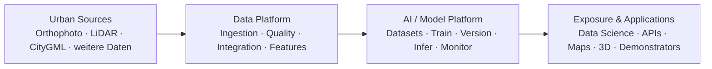
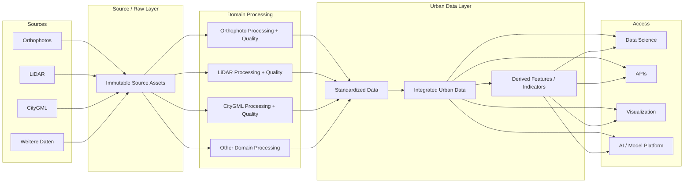
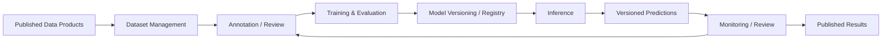
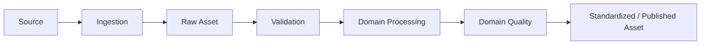
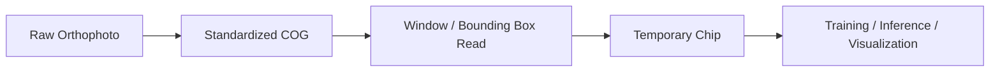
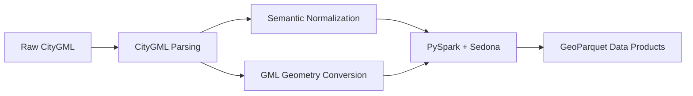
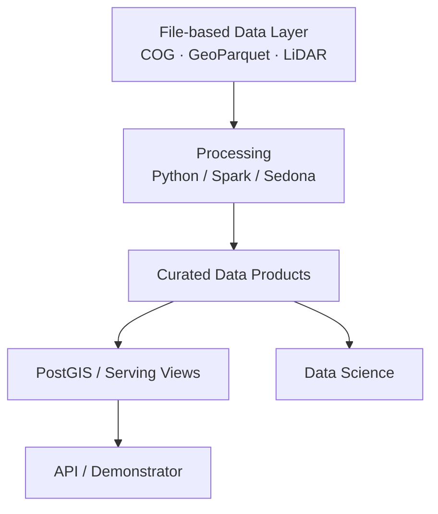
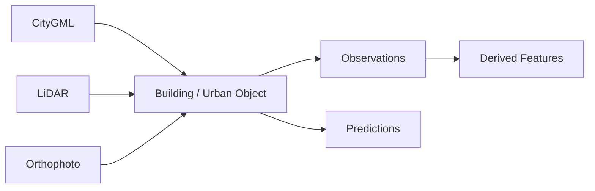
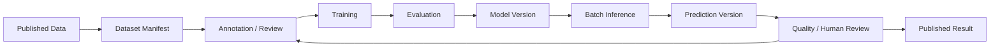

# Urban AI Lab Architecture – L0/L1/L2 Simplification & Data Engineering Patterns

## 1. Ziel dieses Changes

Überarbeite die bestehende Urban-AI-Lab-Dokumentation so, dass sie:

- weiterhin **klein und diskussionsfähig** bleibt,
- aber die **Gesamtvision des Urban AI Lab** sichtbar macht,
- neben dem Data Layer auch die zukünftige **AI / Model Platform** berücksichtigt,
- und auf **L2** bereits ausgewählte grundlegende Data-Engineering-Patterns festhält.

Die Dokumentation soll nicht wieder zu einer großen Enterprise-Architektur anwachsen.

Der gewünschte Scope ist:

```text
L0 – Gesamtarchitektur
L1 – Data Platform + AI / Model Platform
L2 – ausgewählte Architekturbausteine und grundlegende Patterns
L3 – konkrete Implementierung, Tools, Schemas, Deployment
     → vorerst NICHT ausarbeiten
```

Die Seite soll nach dem Umbau weiterhin in wenigen Minuten verständlich sein.

---

# 2. Leitidee der Dokumentation

Die Dokumentation soll ein **zoombares Architekturmodell** bilden.

## L0 – Was bauen wir?

Zeigt das gesamte Urban AI Lab als wenige große Bereiche.

## L1 – Welche Plattformen brauchen wir?

Zeigt die Data Platform und die AI / Model Platform auf logischer Ebene.

## L2 – Wie funktionieren zentrale Architekturbausteine?

Vertieft nur ausgewählte Themen, die echte Architekturentscheidungen enthalten:

1. Domain Data Processing
2. Storage & Access Patterns
3. Data Integration & Transformation
4. AI Model Lifecycle

## L3 – Wie implementieren wir das?

Nicht Gegenstand dieses Changes.

L3 würde später konkrete Dinge enthalten wie:

- konkrete Cloud-/Server-Infrastruktur
- exakte Datenbankschemas
- Spark-Cluster-Konfiguration
- konkrete dbt-Projekte
- konkrete MLflow-/CVAT-Konfiguration
- Docker
- Kubernetes
- Terraform
- produktive Pipelines

---

# 3. Gewünschte sichtbare Navigation

Halte die Navigation kompakt.

Empfohlene Struktur:

```text
Urban AI Lab

├── Start
├── L0 – Gesamtarchitektur
├── L1 – Data Platform
├── L1 – AI / Model Platform
├── L2 – Architekturbausteine
│   ├── Domain Data Processing
│   ├── Storage & Access
│   ├── Data Integration & Transformation
│   └── AI Model Lifecycle
├── Data Domains
└── Entscheidungen & offene Fragen
```

Wichtig:

- maximal ca. 8 sichtbare Seiten
- keine tief verschachtelte Navigation
- keine Operations-/Deployment-Unterseiten
- keine vollständigen Tool-Kataloge
- keine Capability Map mit dutzenden Einträgen
- keine umfangreichen Templates in der sichtbaren Navigation

Bestehende Detailinhalte dürfen im Repository bleiben, sollen aber nicht die Hauptnavigation dominieren.

---

# 4. L0 – Gesamtarchitektur

Datei:

```text
docs/l0-gesamtarchitektur.md
```

Die Seite beantwortet nur:

> Was ist das langfristige Gesamtsystem des Urban AI Lab?

## Diagramm

Verwende ein sehr einfaches Diagramm:



## Erklärung

Unter dem Diagramm maximal vier kurze Aussagen:

1. Urbane Datenquellen werden über eine gemeinsame Data Platform aufgenommen und aufbereitet.
2. Jede Datenart besitzt eine eigene Processing- und Quality-Logik.
3. Die AI / Model Platform nutzt die aufbereiteten Daten für Training, Inference und kontinuierliche Verbesserung.
4. Ergebnisse werden über Data-Science-Zugriffe, APIs, Visualisierungen und Demonstratoren bereitgestellt.

Keine Toolnamen auf L0.

---

# 5. L1 – Data Platform

Datei:

```text
docs/l1-data-platform.md
```

Die Seite beantwortet:

> Wie gelangen heterogene urbane Daten von der Quelle zu nutzbaren Datenprodukten?

## Diagramm

Verwende ungefähr:



## Kernaussagen

### Raw / Source Layer

- Originaldaten bleiben nachvollziehbar erhalten.
- Raw-Daten werden nicht überschrieben.
- Transformationen erzeugen neue Repräsentationen.

### Domain Processing

- jede Datenart hat ihre eigene Processing- und Quality-Logik
- Orthophoto, LiDAR und CityGML werden nicht durch denselben generischen Qualitätsprozess gedrückt

### Standardized Data

- Daten werden in für weitere Verarbeitung geeignete Formate überführt
- Standardisierung bedeutet nicht, dass alle Datendomänen dasselbe Format erhalten

### Integrated Urban Data

- gemeinsame urbane Objekte verbinden Datenquellen
- Gebäude sind zunächst ein wichtiger Integrationsanker
- Source IDs und Provenance bleiben erhalten

### Derived Features

- neue Merkmale werden reproduzierbar aus vorhandenen Daten abgeleitet
- Herkunft, Methode und Version sollen nachvollziehbar bleiben

### Access

- Data Science
- APIs
- Visualisierung
- AI / Model Platform

---

# 6. L1 – AI / Model Platform

Datei:

```text
docs/l1-ai-model-platform.md
```

Diese Seite soll die zukünftige Modellplattform sichtbar machen, aber bewusst abstrakt bleiben.

## Diagramm



## Fähigkeiten auf L1

Nur folgende Bereiche nennen:

- Dataset Management
- Annotation / Label Review
- Training & Evaluation
- Model Versioning
- Preprocessing
- Postprocessing
- Batch Inference
- später optional Online Inference
- Monitoring
- Human Review
- Active Learning
- Prediction Write-back

Wichtig:

> Diese Seite beschreibt nur das Zielbild. Konkrete Tools und Deployments sind noch nicht festgelegt.

---

# 7. L2 – Domain Data Processing

Datei:

```text
docs/l2-domain-processing.md
```

Diese Seite beschreibt das gemeinsame Muster für Datendomänen.

## Gemeinsames Muster



## Wichtige Aussage

Die Pipeline-Struktur kann ähnlich sein, die inhaltliche Quality-Logik ist unterschiedlich.

### Orthophoto

Qualitätsdimensionen auf L2:

- technische Lesbarkeit
- CRS / Auflösung
- Abdeckung
- NoData
- Bildqualität
- zeitliche Eignung

### LiDAR

Qualitätsdimensionen auf L2:

- technische Lesbarkeit
- Punktdichte
- Ausreißer
- Klassifikation
- Höhenreferenz
- räumliche Abdeckung

### CityGML

Qualitätsdimensionen auf L2:

- Schema
- IDs
- geometrische Validität
- Topologie
- Semantik
- Vollständigkeit
- Höhenbezug

Keine konkreten Thresholds definieren.

---

# 8. L2 – Storage & Access Patterns

Datei:

```text
docs/l2-storage-access.md
```

Dies ist eine der wichtigsten neuen Seiten.

Sie beantwortet:

> Wie speichern und lesen wir große urbane Daten so, dass wir sie nicht für jeden Use Case neu kopieren müssen?

## 8.1 Grundprinzip

Dokumentiere:

> Große Geodaten sollen primär als versionierte, offene und für partiellen Zugriff geeignete Assets gehalten werden. Abgeleitete Ausschnitte oder Zwischenprodukte werden möglichst on demand oder als Cache erzeugt, statt dauerhaft in großer Zahl dupliziert zu werden.

## 8.2 Orthophoto Pattern: COG + Dynamic Window Access

Zielbild:



Wichtige Architekturentscheidung:

> Orthophoto-Chips sollen nicht standardmäßig dauerhaft als Millionen einzelner PNG-/JPEG-Dateien gespeichert werden.

Stattdessen:

```text
COG
+
Bounding Box / Window
+
Dataset Manifest
+
Chip Generation Parameters
=
reproduzierbarer Sample
```

### Persistente Chips nur bei begründetem Bedarf

Beispiele:

- Annotationstool benötigt echte Einzeldateien
- temporärer Training Cache
- externer Export
- Benchmark-Dataset
- Debugging
- Performanceoptimierung

Dann aber klar als abgeleitete oder temporäre Assets kennzeichnen.

## 8.3 Dataset Manifest statt Dataset-Kopie

Ein Dataset kann konzeptionell aus Referenzen bestehen:

```yaml
dataset: roof_objects_v1

samples:
  - source_asset: ortho_2025_tile_001
    bbox: [x_min, y_min, x_max, y_max]
    label_reference: label_001

chip_generation:
  width: 1024
  height: 1024
  overlap: 128
  bands: [R, G, B]

split:
  strategy: spatial
  version: v1
```

Wichtige Aussage:

> Dataset-Versionierung soll primär Auswahl, Referenzen, Labels und Generierungslogik versionieren – nicht zwangsläufig vollständige Kopien aller Rasterausschnitte.

## 8.4 Metadata Catalog / STAC Pattern

Dokumentiere STAC als naheliegendes Pattern für große raumzeitliche Assets.

Zielbild:

```text
Catalog
  ↓
Asset Metadata
  ↓
Object / File Storage
  ↓
COG / GeoParquet / weitere Assets
```

Der Katalog soll konzeptionell beantworten:

- Welche Assets existieren?
- Wo liegen sie?
- Welches Gebiet decken sie ab?
- Von wann stammen sie?
- Zu welcher Collection gehören sie?
- Welche Version besitzen sie?

Noch keine produktive STAC-Infrastruktur implementieren.

## 8.5 LiDAR Pattern

Dokumentiere als Zielbild:

```text
Raw LAS / LAZ
→ standardisierte / optimierte Punktwolkenrepräsentation
→ partieller räumlicher Zugriff
→ Processing / Analysis
```

COPC darf als Kandidat genannt werden.

Keine verpflichtende Festlegung, falls noch nicht entschieden.

## 8.6 CityGML Pattern

CityGML bleibt als Source erhalten.

Normalisierte analytische Repräsentationen können file-based gespeichert werden:

```text
Raw CityGML
→ Parsing / Normalization
→ GeoParquet
→ Data Science / Spatial Processing
```

Wichtig:

- Raw CityGML bleibt erhalten
- GeoParquet ist eine analytische Repräsentation
- Source Semantics und IDs dürfen nicht verloren gehen

---

# 9. PySpark + Apache Sedona für CityGML

Diese Architekturhypothese soll ausdrücklich aufgenommen werden.

## 9.1 Bedeutung

Dokumentiere:

> PySpark dient als verteilte Data-Processing-Engine. Apache Sedona erweitert Spark um räumliche Datentypen, Spatial Functions, Spatial Joins und geospatial file processing.

Sedona ist damit keine separate komplette Plattform, sondern eine Geospatial-Erweiterung für Spark-basierte Verarbeitung.

## 9.2 Vorgeschlagenes CityGML Pattern



## 9.3 Wichtige Einschränkung

Nicht behaupten:

```text
CityGML → Sedona
```

als ob Sedona CityGML-Semantik automatisch versteht.

Stattdessen explizit:

1. CityGML muss geparst werden.
2. hierarchische CityGML-Semantik muss normalisiert werden.
3. GML-Geometrien müssen in geeignete Geometry-Repräsentationen überführt werden.
4. anschließend können Spark / Sedona die räumlichen Tabellen skalierbar verarbeiten.

## 9.4 Mögliche normalisierte Datenprodukte

Beispiele:

### buildings

```text
building_id
source_id
building_part_id
attributes
geometry
source_version
```

### roof_surfaces

```text
surface_id
building_id
surface_type
geometry
derived_attributes
source_version
```

### wall_surfaces

```text
surface_id
building_id
surface_type
geometry
derived_attributes
source_version
```

Dies sind nur konzeptionelle Beispiele, keine finalen Schemas.

## 9.5 File-based First

Dokumentiere als Architekturhypothese:

> Standardisierte CityGML-Daten sollen zunächst auch file-based als GeoParquet nutzbar sein. Eine Datenbank ist nicht automatisch die primäre Wahrheit für alle analytischen CityGML-Daten.

---

# 10. Sedona / Spark – wann sinnvoll?

Dokumentiere die Skalierungslogik ausdrücklich.

## Sinnvoll bei:

- großen räumlichen Datenbeständen
- vielen CityGML-Dateien
- landesweiten oder überregionalen Daten
- wiederkehrenden Batch-Jobs
- großen Spatial Joins
- Kombination vieler Datendomänen
- paralleler Feature-Berechnung

## Möglicherweise Overkill bei:

- einzelnen kleinen CityGML-Dateien
- lokalen Experimenten
- wenigen Tausend Gebäuden
- einfachen Transformationen auf einer Workstation

Architekturprinzip:

> Die Zielarchitektur darf skalierbar sein, ohne Spark für jeden lokalen Verarbeitungsschritt verpflichtend zu machen.

Kleinere Implementierungen dürfen zunächst mit lokalen Python-/Geo-Werkzeugen arbeiten, sofern das logische Datenmodell und die Datenprodukte kompatibel bleiben.

---

# 11. File-first Data Layer

Fasse die Zielphilosophie auf L2 zusammen.

```text
Large Geospatial Assets
        ↓
Open / cloud-friendly file formats
        ↓
Object / File Storage
        ↓
Compute on demand
        ↓
Curated Data Products
        ↓
Serving / APIs / Applications
```

Beispiel:

```text
Orthophoto → COG
CityGML    → GeoParquet
LiDAR      → LAZ / ggf. COPC
```

Zentrale Aussage:

> Storage und Compute werden logisch getrennt. Große Datenbestände müssen nicht vollständig in einer zentralen Datenbank materialisiert werden.

---

# 12. Rolle von PostGIS

PostGIS soll nicht entfernt werden, aber seine Rolle klarer beschrieben werden.

## PostGIS eignet sich besonders für:

- kuratierte räumliche Tabellen
- interaktive Objektabfragen
- APIs
- Demonstratoren
- kleinere bis mittlere Spatial Queries
- veröffentlichte Views
- Objekt- und Metadatenintegration
- Serving Layer

## Nicht zwingend primärer Speicher für:

- vollständige Orthophoto-Bestände
- große Roh-Punktwolken
- jede rohe CityGML-Repräsentation
- alle temporären Trainingschips

## Zielbild



---

# 13. L2 – Data Integration & Transformation

Datei:

```text
docs/l2-data-integration-transformation.md
```

Diese Seite beantwortet:

> Wie werden standardisierte Datenquellen in gemeinsame urbane Objekte und abgeleitete Merkmale überführt?

## 13.1 Integration



## 13.2 Prinzipien

- stabile interne Objekt-IDs
- Source IDs bleiben erhalten
- Quellen werden nicht verschmolzen, ohne Provenance zu erhalten
- Observations, Features und Predictions bleiben konzeptionell unterscheidbar
- mehrere Versionen dürfen nebeneinander existieren
- Cross-Source-Konflikte müssen sichtbar bleiben

## 13.3 Structured Transformations as Code

Dokumentiere als L2-Prinzip:

> Transformationen auf strukturierten Daten sollen versioniert, reproduzierbar und als Code definiert werden.

Beispiele:

```text
standardized_buildings
+ lidar_building_heights
+ roof_object_predictions
→ integrated_buildings
→ derived_building_features
→ published_building_dataset
```

---

# 14. Rolle von dbt

dbt soll als **möglicher Kandidat** aufgenommen werden, aber nicht als verpflichtendes Tool.

## Geeignet für:

- SQL-basierte Transformationen
- Tabellen und Views
- Abhängigkeitsgraphen
- versionierte Transformationslogik
- Tests auf strukturierten Daten
- materialisierte Views / Tabellen
- dokumentierte Datenmodelle

## Nicht primär geeignet für:

- GeoTIFF → COG
- Raster-Tiling
- dynamische Raster-Chips
- LAS/LAZ-Verarbeitung
- komplexes CityGML-Parsing
- große Point-Cloud-Verarbeitung
- Computer-Vision-Preprocessing

## Zielbild

```text
Raw Geospatial Processing
    ↓
Python / Spark / Sedona
    ↓
Structured / Curated Tables
    ↓
dbt candidate
    ↓
Integrated / Derived / Published Views
```

Wichtige Aussage:

> dbt ist ein Kandidat für strukturierte Transformationen innerhalb des Data Layers, nicht die zentrale Engine für alle Geodatenverarbeitung.

Wenn dbt verbindlich gewählt wird, soll diese Entscheidung später über einen ADR dokumentiert werden.

---

# 15. L2 – AI Model Lifecycle

Datei:

```text
docs/l2-ai-model-lifecycle.md
```

Beschreibe:



## Zentrale Prinzipien

- Dataset Version != Ordner mit duplizierten Dateien
- Dataset Manifests können auf bestehende Source Assets referenzieren
- Preprocessing ist versioniert
- Postprocessing ist versioniert
- Modelloutput ist Prediction, nicht Ground Truth
- Predictions werden versioniert
- Human Review überschreibt das ursprüngliche Prediction-Ergebnis nicht stillschweigend
- Batch Inference ist zunächst der primäre Modus
- Active Learning ist ein Prozess-Loop, kein einzelner Algorithmus

---

# 16. Data Domains

Datei:

```text
docs/data-domains.md
```

Halte die Seite kompakt.

## Vergleichstabelle

| Aspekt | Orthophoto | LiDAR | CityGML |
|---|---|---|---|
| Datentyp | Raster | Punktwolke | semantisches 3D-Modell |
| primäre Raw-Repräsentation | GeoTIFF / Source Raster | LAS / LAZ | GML / XML |
| mögliche standardisierte Repräsentation | COG | LAZ / COPC-Kandidat | GeoParquet |
| zentrale Einheit | Tile / Asset / Window | Tile / Punkte | Gebäude / Flächen |
| Processing | Windowing, Resampling, Raster Processing | Filterung, Klassifikation, Spatial Processing | Parsing, Normalisierung, Spatial Processing |
| Quality | Bild, Auflösung, Abdeckung | Punktdichte, Ausreißer, Klassifikation | Geometrie, Topologie, Semantik |
| typische Compute-Engine | GDAL / Rasterio / Python | PDAL / Python / ggf. Spark | Python / PySpark + Sedona |
| typische Nutzung | CV, Mapping | Höhe, Gelände, Vegetation | Gebäudeintegration, 3D |

Wichtig:

- Tools nur als Beispiele oder Kandidaten kennzeichnen
- nicht suggerieren, dass alle bereits beschlossen sind

---

# 17. Offene Architekturfragen

Datei:

```text
docs/offene-fragen.md
```

Aktualisiere die Seite.

## Als Nächstes zu entscheiden

Ganz oben maximal 6 priorisierte Fragen:

1. Welche Raw- und Standardformate verwenden wir verbindlich je Datendomäne?
2. Ist COG das Standardformat für aufbereitete Orthofotos?
3. Ist GeoParquet das Standardformat für normalisierte CityGML-Daten?
4. Ab welcher Datengröße / welchem Workflow setzen wir Spark + Sedona ein?
5. Welche Rolle übernimmt PostGIS gegenüber dem file-based Data Layer?
6. Welche strukturierten Transformationen sollen mit dbt umgesetzt werden?

## Storage

- Object Storage / Filesystem?
- Partitionierung?
- Versionierung?
- Retention?
- Cache-Strategien?

## Raster

- COG-Erzeugung
- dynamische Chips
- Dataset Manifests
- Annotation Export

## CityGML

- Parser
- Semantikmodell
- GML → Geometry
- GeoParquet-Schema
- Spark/Sedona-Schwelle

## Integration

- building_id
- Source IDs
- Cross-Source-Matching
- Zeitdimension

## Serving

- welche Daten nach PostGIS?
- welche bleiben file-based?
- welche APIs brauchen wir?

## Transformation

- dbt ja/nein?
- Spark SQL vs dbt?
- welche Tests auf welchem Layer?

---

# 18. Architecture Decisions / ADRs

Ergänze oder aktualisiere ADRs nur dort, wo bereits eine klare Architekturentscheidung getroffen wurde.

## Vorgeschlagene ADRs

### ADR – Raw Data Immutable

Status:

```text
Proposed
```

### ADR – Domain-specific Quality Assurance

Status:

```text
Proposed
```

### ADR – File-first for Large Geospatial Assets

Entscheidung:

> Große Geo-Assets sollen primär file-based gespeichert werden. Datenbanken dienen nicht automatisch als primäre Speicherung für alle Roh- und Analysebestände.

Status:

```text
Proposed
```

### ADR – Dynamic Raster Access

Entscheidung:

> Orthophoto-Chips werden standardmäßig dynamisch aus COG-basierten Source Assets gelesen und nicht als vollständiger persistenter Chip-Bestand dupliziert.

Status:

```text
Proposed
```

### ADR – CityGML Analytical Representation

Entscheidung als Hypothese:

> Normalisierte CityGML-Objekte sollen als GeoParquet nutzbar gemacht werden.

Status:

```text
Proposed
```

### ADR – Spark / Sedona for Scalable Geospatial Processing

Noch nicht als Accepted markieren.

Status:

```text
Proposed
```

### ADR – dbt for Structured Transformations

Noch nicht als Accepted markieren.

Status:

```text
Proposed
```

---

# 19. Tool-Nennung und Architekturgrenze

Tools dürfen auf L2 genannt werden, wenn sie ein Pattern greifbarer machen.

Verwende Kennzeichnungen wie:

```text
Candidate
Proposed
Example
Optional
```

Nicht:

```text
Required
Final
Mandatory
```

solange keine Entscheidung getroffen wurde.

## Beispiele

### Orthophoto

```text
Pattern:
cloud-optimized raster + partial reads

Candidate:
COG + GDAL / Rasterio
```

### CityGML

```text
Pattern:
hierarchical source → normalized spatial tables → file-based analytical product

Candidate:
PySpark + Apache Sedona + GeoParquet
```

### Structured Transformations

```text
Pattern:
transformations as code

Candidate:
dbt
```

### Serving

```text
Pattern:
curated spatial serving layer

Candidate:
PostGIS
```

---

# 20. Nicht wieder überfrachten

Die folgenden Themen sollen NICHT weiter ausgebaut werden:

- Kubernetes
- Kubeflow
- KServe
- vollständiges MLOps Tooling
- konkretes Annotationstool
- konkrete Cloud Provider
- produktive IAM-Struktur
- vollständige Security-Architektur
- Data Mesh
- Data Vault
- Lakehouse-Marketingbegriffe
- vollständige Event-Driven Architecture
- Streaming
- Echtzeit-Inference
- Feature Store
- Vector Database
- LLM Platform

Falls erwähnt, dann nur als future consideration und nicht als sichtbare Hauptarchitektur.

---

# 21. Startseite aktualisieren

Die Startseite soll weiterhin kurz bleiben.

## Textvorschlag

> Das Urban AI Lab entwickelt eine gemeinsame Daten- und KI-Architektur für heterogene urbane Daten wie Orthofotos, LiDAR und CityGML.
>
> Die Dokumentation betrachtet die Architektur aktuell auf drei Ebenen:
>
> - **L0:** Gesamtbild des Urban AI Lab
> - **L1:** Data Platform und AI / Model Platform
> - **L2:** ausgewählte Architekturbausteine und grundlegende Processing-/Storage-Patterns
>
> Konkrete Implementierungsdetails werden bewusst erst auf einer späteren L3-Ebene dokumentiert.

Prominente Links:

- L0 – Gesamtarchitektur
- L1 – Data Platform
- L1 – AI / Model Platform
- L2 – Storage & Access
- Offene Fragen

---

# 22. README aktualisieren

Der aktuelle Fokus soll lauten:

```text
Current focus:
L0 / L1 / selected L2 Urban Data & AI Architecture
```

README kurz halten.

---

# 23. MkDocs Navigation

Empfohlene Navigation:

```yaml
nav:
  - Start: index.md
  - "L0 – Gesamtarchitektur": l0-gesamtarchitektur.md
  - "L1 – Data Platform": l1-data-platform.md
  - "L1 – AI / Model Platform": l1-ai-model-platform.md
  - "L2 – Architekturbausteine":
      - "Domain Data Processing": l2-domain-processing.md
      - "Storage & Access": l2-storage-access.md
      - "Data Integration & Transformation": l2-data-integration-transformation.md
      - "AI Model Lifecycle": l2-ai-model-lifecycle.md
  - "Data Domains": data-domains.md
  - "Entscheidungen & offene Fragen": offene-fragen.md
```

Keine zusätzlichen sichtbaren Navigationsebenen hinzufügen, sofern nicht zwingend notwendig.

---

# 24. Stilregeln

## Dokumentation

- kurz
- technisch klar
- keine Marketingfloskeln
- keine künstliche Vollständigkeit
- Entscheidungen und Hypothesen trennen
- Toolnamen nur dort, wo sie Architekturpattern konkretisieren

## Diagramme

- ein Hauptdiagramm pro Seite
- keine überladenen Kästen
- keine Vendor-Logos
- keine Cloud-Deployment-Symbole
- klare Flussrichtung

## Status

Verwende:

```text
Conceptual
Proposed
Accepted
Future
```

sichtbar dort, wo Entscheidungen noch offen sind.

---

# 25. Akzeptanzkriterien

Der Change ist abgeschlossen, wenn:

## L0

- Gesamtarchitektur enthält Data Platform, AI / Model Platform und Exposure
- L0 bleibt extrem einfach

## L1

- Data Platform ist separat beschrieben
- AI / Model Platform ist separat beschrieben
- beide bleiben logisch, nicht tool-spezifisch

## L2

- Domain Data Processing existiert
- Storage & Access existiert
- Data Integration & Transformation existiert
- AI Model Lifecycle existiert

## Orthophoto

- COG als vorgeschlagenes Standardpattern dokumentiert
- dynamischer Window-Zugriff dokumentiert
- permanente Chip-Explosion explizit vermieden
- Dataset Manifest Pattern dokumentiert

## CityGML

- Raw CityGML bleibt erhalten
- Parsing und Normalisierung separat dargestellt
- GeoParquet als analytische Zielrepräsentation vorgeschlagen
- PySpark + Apache Sedona als skalierbares Processing Pattern beschrieben
- klarer Hinweis, dass Sedona CityGML nicht automatisch semantisch parst

## Data Layer

- file-first Pattern erklärt
- Storage und Compute logisch getrennt
- PostGIS als Serving-/Integration-Layer beschrieben, nicht als zwingender Speicher für alles

## Transformation

- transformations-as-code beschrieben
- dbt als Kandidat für strukturierte Transformationen eingeordnet
- dbt nicht für Raster-/LiDAR-/CityGML-Raw-Processing missbraucht

## AI

- Dataset Manifests
- Training
- Versioning
- Inference
- Predictions
- Review
- Active Learning Loop

mindestens auf L2 enthalten

## Navigation

- weiterhin überschaubar
- maximal ein L2-Untermenü
- keine Rückkehr zur alten 50+-Seiten-Navigation

## Build

- `mkdocs build --strict` erfolgreich
- keine Broken Links
- Mermaid rendert korrekt

---

# 26. Wichtigste Architekturphilosophie

Die Dokumentation soll am Ende folgende Philosophie transportieren:

> Große urbane Geodaten bleiben möglichst in offenen, file-basierten und skalierbaren Repräsentationen. Sie werden nicht für jeden Use Case neu kopiert oder vollständig in eine zentrale Datenbank geladen.

> Orthophotos werden als große, partiell lesbare Raster-Assets gedacht; Ausschnitte werden möglichst dynamisch erzeugt.

> CityGML bleibt als Source erhalten und kann für analytische Verarbeitung in normalisierte, räumliche Tabellen beziehungsweise GeoParquet überführt werden.

> PySpark + Apache Sedona ist ein Kandidat für skalierbare geospatial Batch-Verarbeitung, aber kein Zwang für kleine lokale Workloads.

> PostGIS dient primär dort, wo interaktive, kuratierte und API-nahe räumliche Daten benötigt werden.

> Strukturierte Transformationen werden als Code versioniert; dbt ist dafür ein möglicher Kandidat.

> Die AI / Model Platform arbeitet auf versionierten Datenprodukten und Dataset-Definitionen, nicht auf unkontrollierten Dateiordnern.

> L0 und L1 erklären das System. L2 legt die zentralen Architekturpatterns fest. Erst L3 entscheidet konkrete Implementierungsdetails.

---

# 27. Abschlussbericht des Agents

Nach Abschluss bitte ausgeben:

1. finale Navigation
2. neu erstellte Seiten
3. aktualisierte Seiten
4. welche alten Inhalte weiterhin nur im Repository liegen
5. welche Architekturentscheidungen als Proposed dokumentiert wurden
6. welche Punkte bewusst offen geblieben sind
7. Ergebnis von `mkdocs build --strict`
8. Broken-Link-Status
9. kurze Liste der nächsten 5 Entscheidungen, die das Team treffen sollte

Keine zusätzlichen Architekturthemen eigenständig hinzufügen.
