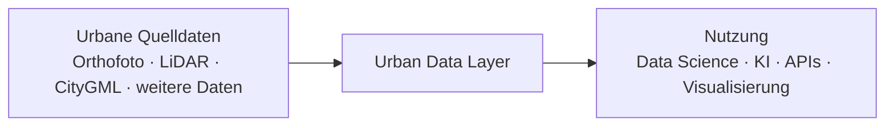
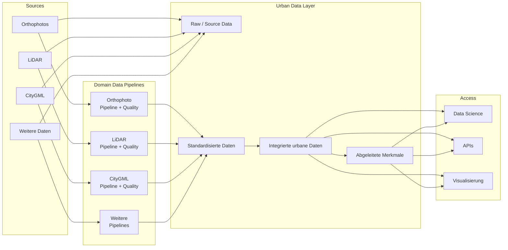

# Urban AI Lab Documentation – Simplification Instructions

## 1. Ziel dieses Changes

Die bestehende Urban-AI-Lab-Dokumentation ist inhaltlich zu groß und wirkt aktuell wie die Spezifikation einer vollständigen Enterprise-Daten- und KI-Plattform.

Das ist für den derzeitigen Projektstand nicht gewünscht.

Die Dokumentation soll bewusst auf ein **kleines, verständliches Architektur-Zielbild für das Datenlayer** reduziert werden.

Der Fokus liegt ausschließlich auf:

- L0 – Vision / Zielbild
- L1 – logische Datenarchitektur
- den drei zentralen Datendomänen Orthofoto, LiDAR und CityGML
- wenigen offenen Architekturfragen

Nicht im sichtbaren Fokus liegen aktuell:

- AI Platform
- Dataset Management
- Annotation
- Training
- Model Registry
- Active Learning
- Deployment
- Operations
- Security
- vollständige Data-Product-Spezifikationen
- technische Implementierungsdetails
- vollständige Pipeline-Spezifikationen
- umfangreiche Templates
- komplette Capability Maps

Die Seite soll nach dem Umbau **klein, diskussionsfähig und nicht einschüchternd** wirken.

---

# 2. Zentrale Leitidee

Die Architektur soll als **zoombares Modell** gedacht werden, aber aktuell nur die obersten Ebenen zeigen:

```text
L0 – Vision
L1 – Datenarchitektur
```

Weitere Ebenen können später ergänzt werden:

```text
L2 – Domänen- oder Plattformarchitektur
L3 – konkrete Pipelines
L4 – technische Implementierung
```

Diese tieferen Ebenen sollen aktuell jedoch nicht in der sichtbaren Navigation dominieren.

---

# 3. Gewünschte sichtbare Navigation

Die öffentlich sichtbare MkDocs-Navigation soll auf folgende Punkte reduziert werden:

```text
Urban AI Lab – Data Architecture

├── Start
├── L0 – Zielbild
├── L1 – Datenarchitektur
├── Data Domains
└── Entscheidungen & offene Fragen
```

Falls die fünfte Seite zu viel wirkt, darf `Entscheidungen & offene Fragen` auch als Abschnitt auf der L1-Seite integriert werden.

Zielgröße:

- 4 bis maximal 5 sichtbare Navigationspunkte
- keine verschachtelte Navigation mit dutzenden Unterseiten
- keine sichtbare AI-Platform-Struktur
- keine sichtbare Operations-Struktur
- keine sichtbaren Templates
- keine sichtbaren ADR-Unterordner

---

# 4. Bestehende Inhalte nicht löschen

Bestehende Dokumentation soll nicht unnötig gelöscht werden.

Vorgehen:

1. Inhalte, die aktuell nicht mehr sichtbar sein sollen, aus `mkdocs.yml` entfernen.
2. Bestehende Dateien im Repository behalten.
3. Optional in einen klar benannten Bereich verschieben, z. B.:

```text
docs/archive/
```

oder:

```text
docs/future/
```

4. Keine Inhalte verlieren, nur die sichtbare Dokumentationsoberfläche vereinfachen.
5. Keine toten Links erzeugen.
6. README und interne Links an die neue Struktur anpassen.

Wichtig:

> Die Reduktion betrifft primär die sichtbare Informationsarchitektur, nicht den vollständigen Wissensbestand im Repository.

---

# 5. Startseite

Datei:

```text
docs/index.md
```

Die Startseite soll sehr kurz sein.

## Inhalt

### Titel

```text
Urban AI Lab – Data Architecture
```

### Kurzbeschreibung

Verwende sinngemäß folgenden Text:

> Das Urban AI Lab entwickelt eine gemeinsame Datenbasis für heterogene urbane Daten wie Orthofotos, LiDAR und CityGML.
>
> Die Architektur beschreibt, wie diese Daten aufgenommen, datentypspezifisch qualitätsgesichert, standardisiert, miteinander verknüpft und für Analyse, Data Science und spätere KI-Anwendungen bereitgestellt werden.

Danach:

```text
Diese Dokumentation konzentriert sich aktuell bewusst auf zwei Ebenen:

L0 – Zielbild
L1 – Datenarchitektur
```

Dann zwei oder drei prominent sichtbare Links:

- L0 – Zielbild
- L1 – Datenarchitektur
- Data Domains

Keine lange Einleitung.

Keine Capability Map auf der Startseite.

Keine vollständige AI-Platform-Grafik.

Keine umfangreiche Roadmap.

---

# 6. L0 – Zielbild

Neue oder vereinfachte Seite:

```text
docs/l0-zielbild.md
```

Die Seite soll nur eine zentrale Frage beantworten:

> Was soll das Urban Data Layer grundsätzlich leisten?

## Mermaid-Diagramm

Verwende ein sehr einfaches Diagramm:



## Erklärung

Unter dem Diagramm nur drei kurze Aussagen:

1. Unterschiedliche urbane Datenquellen werden in einer gemeinsamen Datenarchitektur verwaltet.
2. Jede Datenart behält ihre eigene Ingestion-, Transformations- und Qualitätssicherungslogik.
3. Nach der Aufbereitung können Daten gemeinsam analysiert, kombiniert und für Anwendungen bereitgestellt werden.

Optional ein kurzer Hinweis:

> Die AI-/ML-Plattform wird aktuell bewusst nicht vertieft. Sie wird zunächst nur als nachgelagerter Nutzer des Datenlayers betrachtet.

Mehr Inhalt ist auf L0 nicht notwendig.

---

# 7. L1 – Datenarchitektur

Datei:

```text
docs/l1-datenarchitektur.md
```

Diese Seite ist die zentrale technische Seite.

Sie beantwortet:

> Wie fließen Daten vom Quellsystem bis zu nutzbaren urbanen Daten?

## Zielarchitektur

Verwende ein Diagramm in ungefähr folgender Form:



Der Agent darf das Diagramm optisch vereinfachen, aber die logische Trennung muss erhalten bleiben.

---

# 8. Erklärung der L1-Bausteine

Unter dem Diagramm maximal fünf kurze Abschnitte.

## 8.1 Sources

Beschreiben:

- Orthofotos
- LiDAR
- CityGML
- weitere urbane Daten

Zentrale Aussage:

> Diese Quellen unterscheiden sich stark in Format, Semantik, räumlicher Struktur, Aktualität und Qualitätsanforderungen.

## 8.2 Raw / Source Data

Zentrale Aussagen:

- Originaldaten bleiben nachvollziehbar erhalten.
- Rohdaten werden nicht stillschweigend überschrieben.
- Transformierte Daten sind neue Repräsentationen.

Nicht in konkrete Storage-Technologien abdriften.

## 8.3 Domain Data Pipelines

Das ist der wichtigste Architekturpunkt.

Explizit dokumentieren:

> Jede Datenart besitzt ihre eigene Ingestion-, Transformations- und Qualitätssicherungslogik.

Beispiele:

```text
Orthofoto
→ Raster- und Bildqualität

LiDAR
→ Punktdichte, Ausreißer, Klassifikation, Abdeckung

CityGML
→ Geometrie, Topologie, Semantik, Vollständigkeit
```

Zentrale Architekturregel:

> Qualitätsprüfung ist datentypspezifisch. Gemeinsame Standards betreffen nur Metadaten, Status, Versionierung, Lineage und Veröffentlichung.

Keine vollständigen Qualitätsregel-Kataloge auf L1.

## 8.4 Integrated Urban Data

Beschreiben:

- standardisierte Daten können miteinander verknüpft werden
- räumliche Objekte bilden die Integrationspunkte
- Gebäude sind aktuell ein besonders wichtiger gemeinsamer Anker
- später können weitere Objekttypen hinzukommen

Beispiel:

```text
Building
├── CityGML-Geometrie
├── zugehörige Orthofoto-Ausschnitte
├── LiDAR-Beobachtungen
├── abgeleitete Merkmale
└── spätere Modellvorhersagen
```

Keine finale Datenbankstruktur definieren.

## 8.5 Access

Beschreiben:

- Data Science
- APIs
- Visualisierung

Zentrale Aussage:

> Das Datenlayer stellt aufbereitete und nachvollziehbare Daten bereit. Wie die spätere vollständige AI-/ML-Plattform aufgebaut wird, ist aktuell nicht Bestandteil dieser Dokumentationsstufe.

---

# 9. Data Domains

Datei:

```text
docs/data-domains.md
```

Keine verschachtelten Unterseiten für Orthofoto, LiDAR und CityGML in der sichtbaren Navigation.

Die Seite soll einen einfachen Vergleich enthalten.

## Tabelle

Verwende ungefähr:

| Aspekt | Orthofoto | LiDAR | CityGML |
|---|---|---|---|
| Datentyp | Raster | Punktwolke | semantisches 3D-Modell |
| zentrale Einheit | Tile / Asset | Tile / Punkte | Gebäude / Flächen |
| typische Verarbeitung | Tiling, Konvertierung, Ausschnitte | räumliche Indizierung, Klassifikation | Parsing, Normalisierung |
| Qualitätsschwerpunkt | Bild, Auflösung, Abdeckung | Punktdichte, Ausreißer, Klassifikation | Geometrie, Topologie, Semantik |
| typische Nutzung | Computer Vision, Mapping | Höhe, Gelände, Vegetation | Gebäudeintegration, 3D |

Darunter maximal ein kurzer Abschnitt pro Datenart.

## Orthofoto

Nur Übersichtsebene:

- Raster
- räumliche Auflösung
- Kacheln
- Bildqualität
- Abdeckung
- zeitliche Aktualität
- Nutzung für Computer Vision

## LiDAR

Nur Übersichtsebene:

- Punktwolke
- Punktdichte
- Klassifikation
- Höhenbezug
- Abdeckung
- Nutzung für Gelände, Höhe und Vegetation

## CityGML

Nur Übersichtsebene:

- semantisches 3D-Modell
- Gebäude und Building Parts
- Dach- und Fassadenflächen
- Geometrie
- Topologie
- Semantik
- Vollständigkeit

Abschlusssatz:

> Die konkrete Pipeline- und Qualitätsspezifikation einer Datendomäne wird erst vertieft, wenn diese Domäne aktiv implementiert oder überarbeitet wird.

---

# 10. Entscheidungen & offene Fragen

Datei:

```text
docs/offene-fragen.md
```

Die Seite soll ausdrücklich kein fertiges Architekturdesign vortäuschen.

Sie dient als Arbeitsliste für das Team.

Strukturiere nach Themen.

## Storage und Dateiformate

Offene Fragen:

- Welche Rohdaten bleiben dateibasiert?
- Welche standardisierten Formate verwenden wir?
- Welche Daten gehören in Object Storage?
- Welche Daten gehören in eine räumliche Datenbank?
- Welche Daten werden materialisiert und welche on demand erzeugt?

## Integration

- Was ist die stabile interne Gebäude-ID?
- Welche weiteren urbanen Objekte benötigen stabile IDs?
- Wie werden Source IDs erhalten?
- Wie werden unterschiedliche Aufnahmezeitpunkte behandelt?
- Wie werden Cross-Source-Konflikte sichtbar gemacht?

## Versionierung und Lineage

- Welche Granularität benötigen Datenversionen?
- Wie referenzieren abgeleitete Werte ihre Quellen?
- Wie werden Pipeline-Versionen dokumentiert?
- Wie werden Änderungen nachvollzogen?

## Zugriff

- Wie sollen Data Scientists Daten erhalten?
- SQL?
- Files?
- GeoParquet?
- Python API?
- STAC?
- Kombination?

## Qualität

- Welche Qualitätsdimensionen sind pro Datendomäne wirklich relevant?
- Welche Checks blockieren eine Veröffentlichung?
- Welche Checks erzeugen nur Warnungen?
- Welche Qualitätsinformationen müssen beim Datenzugriff sichtbar sein?

## Zukunft

- Wie dockt später die AI-/ML-Plattform an?
- Welche Datenprodukte werden zuerst benötigt?
- Welche Use Cases bestimmen die Priorität der Architekturentscheidungen?

Keine Antworten erfinden.

Bereits entschiedene Punkte können als `Decision` markiert werden.

---

# 11. Was aus der Navigation entfernt werden soll

Entferne folgende Bereiche aus der sichtbaren `mkdocs.yml`-Navigation:

- Capability Map
- vollständige Data Platform Unterstruktur
- AI Platform
- Dataset and Annotation Management
- Training and Experiments
- Model Registry
- Preprocessing / Postprocessing
- Inference
- Monitoring
- Active Learning
- vollständige Data Products Navigation
- Use Cases
- Roof Object Detection Vertical Slice
- Interfaces Unterseiten
- Operations
- Deployment
- Observability
- Security and Governance
- Backup and Recovery
- Cost Management
- Templates
- ADR-Einzelseiten

Die Inhalte dürfen im Repository verbleiben.

---

# 12. Umgang mit bestehenden ADRs

ADRs dürfen im Repository bleiben.

Sie müssen aber aktuell nicht prominent in der Navigation sichtbar sein.

Falls die Seite `Entscheidungen & offene Fragen` auf bestehende ADRs verweist, reicht ein kurzer Link wie:

```text
Technische Entscheidungen werden bei Bedarf weiterhin als ADR im Repository dokumentiert.
```

Keine lange ADR-Liste auf der Hauptseite.

---

# 13. README vereinfachen

Die Repository-README soll ebenfalls reduziert werden.

Sie soll nur enthalten:

1. Zweck
2. aktueller Fokus
3. lokale MkDocs-Nutzung
4. Repository-Struktur
5. Hinweis auf zukünftige Inhalte

Der aktuelle Fokus soll ausdrücklich lauten:

```text
Current focus:
L0 / L1 Urban Data Architecture
```

Nicht mehr den Eindruck erwecken, dass bereits eine vollständige AI-Plattform spezifiziert wird.

---

# 14. MkDocs-Konfiguration

Passe `mkdocs.yml` so an, dass die Navigation ungefähr lautet:

```yaml
nav:
  - Start: index.md
  - "L0 – Zielbild": l0-zielbild.md
  - "L1 – Datenarchitektur": l1-datenarchitektur.md
  - "Data Domains": data-domains.md
  - "Entscheidungen & offene Fragen": offene-fragen.md
```

Bestehende Markdown-Dateien müssen nicht gelöscht werden.

Wenn sie nicht in `nav` stehen, sollen sie nicht prominent in der Website-Navigation auftauchen.

Prüfe, ob Theme-Funktionen automatisch versteckte Dateien in Suchergebnissen oder Navigation sichtbar machen. Falls notwendig, nutze geeignete MkDocs-Konfiguration, ohne das Repository unnötig komplex zu machen.

---

# 15. Stilregeln für die reduzierte Dokumentation

## Inhalt

- kurze Abschnitte
- wenig Text
- Architektur vor Tooling
- keine langen Feature-Listen
- keine vollständigen Qualitätskataloge
- keine künstliche Vollständigkeit
- keine unbelegten Technologieentscheidungen
- keine Buzzword-Sammlungen

## Diagramme

- maximal ein zentrales Diagramm pro Seite
- L0 extrem einfach
- L1 maximal ungefähr 12–15 sichtbare Hauptbausteine
- keine Tool-Logos
- keine Cloud-Produkte
- keine Deployment-Komponenten

## Sprache

- Deutsch als Hauptsprache
- etablierte technische Begriffe dürfen Englisch bleiben
- verständlich für Data Scientists, Engineers und Projektverantwortliche
- keine Enterprise-Architecture-Sprache um ihrer selbst willen

---

# 16. Was explizit NICHT gemacht werden soll

Nicht:

- neue AI-Plattform-Seiten hinzufügen
- bestehende AI-Plattform weiter ausarbeiten
- Kubernetes diskutieren
- Annotationstools vergleichen
- MLflow, Kubeflow, KServe etc. prominent machen
- Cloud-Infrastruktur designen
- ein finales physisches Datenbankschema definieren
- vollständige Data Contracts erstellen
- konkrete Quality Thresholds erfinden
- umfangreiche Roadmaps erstellen
- zusätzliche Navigationspunkte hinzufügen
- eine umfassende Capability Map sichtbar machen
- jeden denkbaren Use Case dokumentieren

Die Dokumentation soll bewusst **unvollständig, aber strukturell sauber** sein.

---

# 17. Zielzustand nach dem Umbau

Ein neuer Besucher soll innerhalb von ungefähr 2–3 Minuten verstehen können:

1. Welche Datenquellen betrachtet das Urban AI Lab?
2. Was ist das Urban Data Layer?
3. Warum werden Orthofoto, LiDAR und CityGML unterschiedlich verarbeitet?
4. Wie werden die Daten nach der Aufbereitung integriert?
5. Wie können Data Scientists und Anwendungen später darauf zugreifen?
6. Welche Architekturfragen sind noch offen?

Ein Besucher soll **nicht** das Gefühl bekommen, zuerst 50 Seiten lesen zu müssen.

---

# 18. Akzeptanzkriterien

Der Change ist abgeschlossen, wenn:

- die sichtbare Navigation maximal 5 Punkte enthält
- Startseite deutlich kürzer ist
- eine einfache L0-Seite existiert
- eine zentrale L1-Datenarchitekturseite existiert
- Data Domains auf einer einzigen sichtbaren Seite zusammengefasst sind
- offene Architekturfragen an einer Stelle gesammelt sind
- AI Platform nicht mehr sichtbar im Vordergrund steht
- bestehende Inhalte nicht unnötig gelöscht wurden
- keine toten Links entstanden sind
- `mkdocs build --strict` erfolgreich läuft
- Mermaid-Diagramme korrekt rendern
- Website mobil und Desktop sauber lesbar ist
- die Architektur nicht so wirkt, als sei sie bereits vollständig entschieden
- Qualitätssicherung klar als datentypspezifisch dargestellt wird
- Data Science / AI nur als nachgelagerter Consumer des Datenlayers erscheint

---

# 19. Gewünschter Abschlussbericht des Agents

Nach der Änderung bitte ausgeben:

1. welche Seiten neu erstellt wurden
2. welche Seiten vereinfacht wurden
3. welche Inhalte aus der sichtbaren Navigation entfernt wurden
4. ob bestehende Inhalte verschoben oder nur ausgeblendet wurden
5. die finale `nav`-Struktur
6. Ergebnis von `mkdocs build --strict`
7. verbleibende offene Fragen oder mögliche Broken Links
8. kurze Empfehlung für den nächsten sinnvollen Architekturschritt

---

# 20. Wichtigste Leitlinie

Wenn bei einer Entscheidung unklar ist, ob ein zusätzlicher Inhalt aufgenommen werden soll, gilt:

> Weniger ist besser.

Die Dokumentation soll aktuell nicht die vollständige Urban-AI-Lab-Plattform beschreiben.

Sie soll nur das gemeinsame Verständnis für das **Urban Data Layer auf L0/L1** schaffen und eine saubere Basis bieten, später gezielt tiefer zu gehen.
